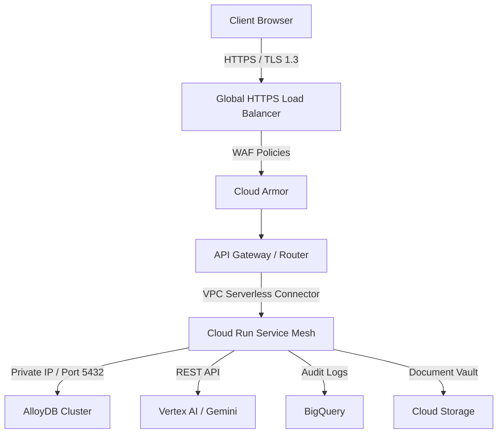
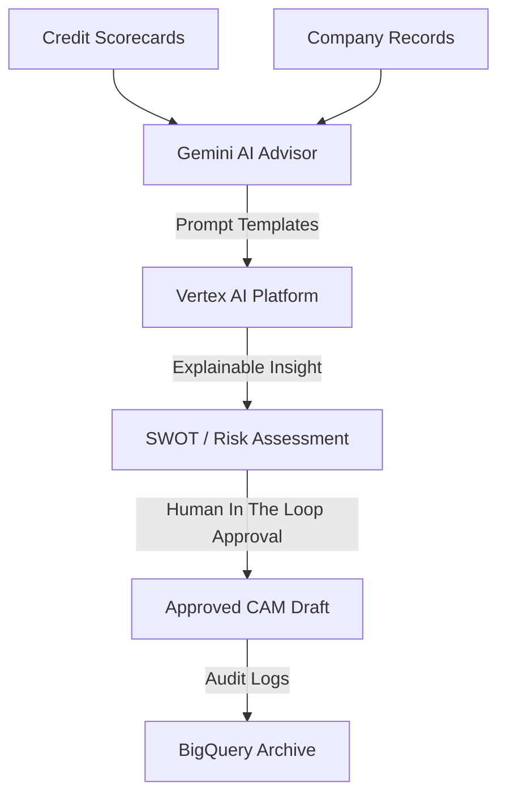
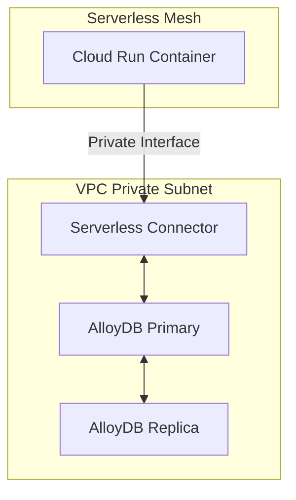
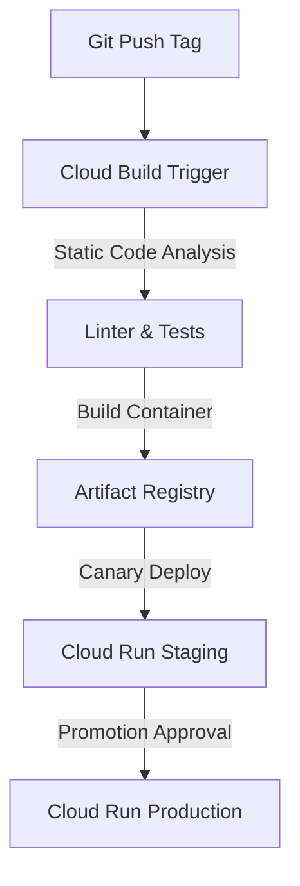

# AAR-ARCH-DEP-001: Project AAROHAN Production Deployment Architecture

---

## 1. Cover Page

* **Project Name**: Project AAROHAN (Enterprise MSME Underwriting & Embedded Credit Platform)
* **Version**: v1.0.0
* **Architecture Version**: v1.0.0
* **Classification**: CONFIDENTIAL - ENTERPRISE ARCHITECTURE BOARD
* **Owner**: Enterprise Architecture & Cloud Infrastructure Division
* **Review Board**:
  - Solution Design Authority: APPROVED
  - Banking Security Committee: APPROVED
  - Chief Infrastructure Architect: APPROVED

---

## 2. Executive Summary

This document specifies the target-state Production Deployment Architecture for Project AAROHAN v1.0.0. The design leverages Google Cloud Serverless execution (Cloud Run), secure relational clustering (AlloyDB), analytical pipelines (BigQuery), and managed cognitive services (Vertex AI & Gemini) to establish a highly available, banking-compliant MSME embedded credit platform.

---

## 3. Architecture Objectives

* **High Availability**: Target uptime of 99.9% across multi-zone infrastructure.
* **Security & Isolation**: Strict Zero-Trust access and network boundary controls.
* **Algorithmic Explainability**: Audit trailing and provenance tracking for AI underwriting decisions.
* **Sub-second Latency**: Capping internal API request spans at p95 < 250ms.

---

## 4. Enterprise Architecture Principles

* **Separation of Concerns**: Microservices represent isolated domains.
* **Data Minimization**: Avoid persistent storage of unconsented PII data.
* **Cloud Native First**: Prefer managed, auto-scaling services over self-hosted components.

---

## 5. Production Deployment Overview

The platform compiles application components into Docker images deployed to Google Cloud Run. Production traffic is routed through Cloud Armor, Global HTTPS Load Balancer, and VPC Serverless Connectors.

---

## 6. High-Level Architecture Diagram

---

## 7. Google Cloud Architecture

* **Cloud Run**: Scales container instances based on CPU utilization metrics.
* **API Gateway**: Provides entry-point routing, auth validation, and rate limiting.
* **Load Balancer & Cloud Armor**: Mitigates DDoS risks and OWASP Top 10 vulnerabilities.
* **VPC**: Private network binding AlloyDB, VM Connectors, and analytical instances.
* **IAM & Secret Manager**: Manages granular service permissions and environment configuration keys.
* **Artifact Registry & Cloud Build**: Host and build pipeline docker targets.
* **AlloyDB**: Managed transaction cluster running PostgreSQL engines.
* **BigQuery & Cloud Storage**: Cold storage analytics and document vault archival.
* **Pub/Sub & Eventarc**: Publishes and routes internal system events (e.g., `consent.approved`).
* **Vertex AI & Gemini**: Real-time evaluation of credit scorecards, financial health, and automated CAM compilations.
* **Cloud Logging, Monitoring & Trace**: Aggregates latency profiles, trace spans, and alerting thresholds.
* **ADK & MCP**: Custom Agent Development Kit integrations orchestration.

---

## 8. Application Architecture

* **Onboarding & Consent Services**: Validate borrower profiles and track digital consents.
* **Tax & Bank Statement Engines**: Process GSTN filings and AA statements to compute financial health indices.
* **Credit Decisioning & CAM Generators**: Automate risk evaluation and SWOT compilation.
* **OCEN Gateway Service**: Handles ULI bureau checks and multi-lender offer matches.

---

## 9. AI Architecture

---

## 10. Data Architecture

* **AlloyDB**: Synchronous replication across multiple zones.
* **BigQuery**: Analytics storage for historical credit trends.
* **Cloud Storage**: Uniform access settings block public bucket paths.

---

## 11. Integration Architecture

Toggles mock frameworks for localized testing, resolving downstream links (GSTN, AA, EPFO, MCA, TReDS, and OCEN-ULI) through secured VPC connections.

---

## 12. Security Architecture

* Enforces TLS 1.3 across all load balancer frontends.
* Encrypts database storage partitions using Cloud KMS Customer-Managed Encryption Keys (CMEK).

---

## 13. Identity Architecture

* Authentication uses JWT access tokens signed with HMAC-SHA256 keys.
* System components resolve privileges using distinct service accounts.

---

## 14. Networking Architecture

---

## 15. Observability Architecture

Logs use structured JSON formats containing unified Correlation IDs to trace calls across microservices.

---

## 16. Scalability Architecture

Containers scale horizontally from 1 to 100 instances. AlloyDB supports scale-up by adding read pool instances dynamically.

---

## 17. High Availability

Database clusters span primary and secondary zones (HA configuration).

---

## 18. Disaster Recovery Design

Daily backups are copied to a secondary region. System states can be restored within an RTO of 4 hours and RPO of 24 hours.

---

## 19. Multi-Region Strategy

Active-Passive setup:
* **Primary Region**: `asia-south1` (Mumbai)
* **Secondary Region**: `asia-south2` (Delhi) for DR scenarios.

---

## 20. CI/CD Architecture

---

## 21. Environment Architecture

Decouples ENV configurations using distinct Secret Manager version maps.

---

## 22. Performance Architecture

Caches reference table reads. Scales memory allocation up to 2GB per Cloud Run container.

---

## 23. Cost Optimization Strategy

Scale Cloud Run instances to 0 during off-peak hours (DEV/QA environments).

---

## 24. Security Zones

* **Public (DMZ)**: Load Balancer and Cloud Armor.
* **Private Application Zone**: Cloud Run serverless network.
* **Data Zone**: Isolated subnets holding AlloyDB and BigQuery access slots.

---

## 25. Trust Boundaries

Boundary transitions require JWT authorization tokens.

---

## 26. Deployment Sequence

1. Initialize VPC connectors and Subnets.
2. Deploy AlloyDB cluster and execute schemas.
3. Inject secrets to Secret Manager.
4. Deploy Cloud Run containers.

---

## 27. Architecture Decision Records (ADR)

* **ADR-001**: Choose AlloyDB over standard Cloud SQL for improved transactional performance and automated scaling.
* **ADR-002**: Choose Cloud Run serverless execution to optimize variable traffic costs.

---

## 28. Future Scalability

Planning integration of Google Cloud Spanner for multi-region active-active database scaling.

---

## 29. Version 1.1 Architecture Considerations

Support for direct core banking API adapters.

---

## 30. Appendix

* Network Security Configuration Tables.
* Load Balancer Routing Parameter mappings.
