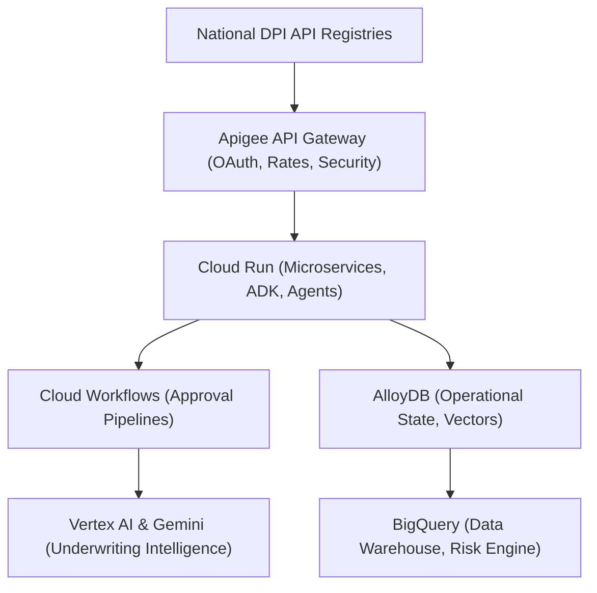

# Enterprise Digital Public Infrastructure (DPI), India Stack & Ecosystem Partnership Strategy

**Document ID:** AAR-DIG-045  
**Document Name:** Enterprise Digital Public Infrastructure (DPI), India Stack & Ecosystem Partnership Strategy  
**Version:** 1.0  
**Status:** Approved / Production-Ready  
**Dependencies:** AAR-LRM-044 (Enterprise Product Roadmap)  
**Target Audience:** IDBI Bank Board, MD & CEO, CIO, CTO, CBO, CCO, CRO, Ministry of Finance, RBI Observers, and Google Cloud Professional Services  

---

## 1. Executive Summary & India Vision Alignment

### Executive Summary
Project AAROHAN positions IDBI Bank at the forefront of India's financial transformation by serving as an AI-native MSME Financial Growth Operating System built directly on the Digital Public Infrastructure (DPI) and India Stack ecosystem. This strategic blueprint defines the integration models, partnership frameworks, and data governance standards necessary to leverage national digital assets (Account Aggregator, ULI, OCEN, GSTN, ONDC, and UPI). By combining public-private digital collaboration with Google Cloud's AI engine (Vertex AI, Gemini, and Apigee API Gateway), AAROHAN moves credit evaluation from asset-based collateral to transaction-driven flow, accelerating credit access and advancing financial inclusion at a national scale.

### India Vision Alignment
AAROHAN aligns with the Government of India’s digital economy initiatives:
*   **Viksit Bharat 2047:** Supporting self-reliant micro, small, and medium businesses (MSMEs) through formal credit channels.
*   **Unified Lending Interface (ULI):** Accelerating credit delivery by standardizing land, tax, and identity document checks.
*   **Digital Financial Inclusion:** Reaching underserved regions and informal trading corridors with quick, structured credit.

### Strategic Objectives
1.  **DPI-First Underwriting:** Move from traditional asset valuation to real-time transaction verification using tax and utility registries.
2.  **Open Banking Leadership:** Develop open APIs using Apigee to integrate credit, payments, and risk management into third-party MSME platforms.
3.  **National Scale Integration:** Connect into regional and state-level business support systems to reduce manual paperwork.

### Guiding Principles
*   **Informed Consent First:** Every data query must be initiated by the borrower and tracked using digital consent architectures.
*   **Data Minimization:** Only pull the data points required to calculate credit scores and verify identity, avoiding unnecessary storage of customer PII.
*   **Secure API Access:** Expose and connect to APIs using secure gateways that handle rate limits, traffic management, and OAuth validation.

---

## 2. Digital Public Infrastructure Domains

AAROHAN integrates with 20 critical public digital infrastructure registries to power its credit and onboarding pipelines.

---

### DPI-01: Account Aggregator (AA)
*   **Strategic Purpose:** Fetch consolidated bank statement data directly from other financial institutions with explicit customer consent.
*   **Business & Banking Value:** Replaces manual PDF bank statement uploads, eliminating forgery risks and reducing document collection time.
*   **Customer Value:** Borrowers do not need to visit branch offices or download statement files from online banking portals.
*   **AI Opportunities:** Vertex AI parses statement rows to categorize expenses, identify non-operational income, and calculate average daily balances.
*   **Financial Inclusion Impact:** Allows businesses without audited financial statements to prove cash flow patterns.
*   **Credit Assessment Contribution:** Provides the primary transaction data for cash flow analysis and debt-service capacity validation.
*   **Regulatory & Data Governance:** Complies with RBI Account Aggregator guidelines; enforces temporary, single-use consent structures.
*   **Business KPIs:** AA verification success rate > 95%; time-to-fetch data < 30 seconds.
*   **Google Cloud Capability Mapping:** Apigee, Cloud Run, BigQuery, AlloyDB.
*   **Future Expansion:** Automated quarterly re-verifications to track portfolio health post-disbursement.

---

### DPI-02: Unified Lending Interface (ULI)
*   **Strategic Purpose:** Streamline credit evaluation by connecting to land records, credit bureaus, and regional databases.
*   **Business & Banking Value:** Speeds up property valuation and ownership checks, reducing credit processing bottlenecks.
*   **Customer Value:** Speeds up decisions for secured MSME loans.
*   **AI Opportunities:** Gemini parses local land record formats and flags ownership disputes or existing liens.
*   **Financial Inclusion Impact:** Improves credit access for rural MSMEs by making agricultural and semi-urban properties easier to collateralize.
*   **Credit Assessment Contribution:** Accelerates identity verification and provides verified collateral data.
*   **Regulatory & Data Governance:** Complies with RBI ULI integration standards; logs all property checks.
*   **Business KPIs:** ULI data response time < 15 seconds; collateral check validation rate > 99%.
*   **Google Cloud Capability Mapping:** Apigee, Document AI, BigQuery.
*   **Future Expansion:** Real-time property tax payment tracking to monitor collateral health.

---

### DPI-03: Open Credit Enablement Network (OCEN)
*   **Strategic Purpose:** Interface with third-party digital apps acting as Loan Agents to offer credit directly on external platforms.
*   **Business & Banking Value:** Expands loan origination channels without requiring additional physical branch offices.
*   **Customer Value:** Borrowers access credit within the business applications they use daily.
*   **AI Opportunities:** Automates real-time loan offers by analyzing customer transaction histories inside partner apps.
*   **Financial Inclusion Impact:** Extends credit options to micro-enterprises on retail and logistics platforms.
*   **Credit Assessment Contribution:** Provides transaction data from point-of-sale platforms to refine credit decisions.
*   **Regulatory & Data Governance:** Follows OCEN API specifications; maintains clear separation between credit underwriters and loan agents.
*   **Business KPIs:** Number of loans sourced via OCEN channels; average loan processing time < 15 minutes.
*   **Google Cloud Capability Mapping:** Apigee, Cloud Run, Pub/Sub.
*   **Future Expansion:** Support for dynamic, multi-lender credit bidding networks.

---

### DPI-04: Goods and Services Tax Network (GSTN)
*   **Strategic Purpose:** Fetch verified sales, invoice, and purchase summaries directly from the national tax network.
*   **Business & Banking Value:** Confirms actual sales figures, checks customer concentrations, and validates business volumes.
*   **Customer Value:** Borrowers do not need to manually submit sales ledger files or paper tax filing receipts.
*   **AI Opportunities:** Runs risk modeling on invoice histories to identify high customer concentrations or payment delays.
*   **Financial Inclusion Impact:** Connects informal businesses to formal credit pathways by validating tax filings.
*   **Credit Assessment Contribution:** Serves as the primary source to verify revenue figures and invoice compliance.
*   **Regulatory & Data Governance:** Uses secure GST API portals; handles consent tokens via the Account Aggregator or direct OTP frameworks.
*   **Business KPIs:** GST verification completion rate > 98%; invoice mapping precision = 100%.
*   **Google Cloud Capability Mapping:** Apigee, Cloud Run, BigQuery.
*   **Future Expansion:** Automated warning triggers when tax filing dates are missed or delayed.

---

### DPI-05: Unified Payments Interface (UPI)
*   **Strategic Purpose:** Process loan repayments and enable real-time credit disbursements.
*   **Business & Banking Value:** Simplifies collections and reduces payment processing overhead.
*   **Customer Value:** Borrowers can repay loans instantly using any standard UPI-enabled mobile application.
*   **AI Opportunities:** Analyzes UPI merchant settlement histories to forecast daily sales trends.
*   **Financial Inclusion Impact:** Enables small, cash-dependent retailers to build verified payment histories.
*   **Credit Assessment Contribution:** Provides real-time data on merchant daily sales performance.
*   **Regulatory & Data Governance:** Follows NPCI specifications; enforces secure transactional limits.
*   **Business KPIs:** UPI payment success rate > 99.5%; repayment settlement latency < 5 seconds.
*   **Google Cloud Capability Mapping:** Apigee, Cloud Run, AlloyDB.
*   **Future Expansion:** Autopay setups for recurring micro-repayments.

---

### DPI-06: Trade Receivables Discounting System (TReDS)
*   **Strategic Purpose:** Finance MSME invoices accepted by large corporate buyers on national trading exchanges.
*   **Business & Banking Value:** Lowers credit risk by underwriting loans based on the credit profile of corporate buyers.
*   **Customer Value:** Converts outstanding receivables into immediate working capital.
*   **AI Opportunities:** Evaluates invoice pricing models and matches them against historical payment times.
*   **Financial Inclusion Impact:** Directs liquidity to small suppliers working with major public and private enterprises.
*   **Credit Assessment Contribution:** Underwrites trade transactions based on corporate credit profiles.
*   **Regulatory & Data Governance:** Integrates with certified RBI-licensed TReDS portals; enforces strict invoice checks to prevent double-financing.
*   **Business KPIs:** Average invoice financing time < 2 hours; delinquency rate on corporate invoice factoring < 0.2%.
*   **Google Cloud Capability Mapping:** Apigee, Cloud Workflows, AlloyDB.
*   **Future Expansion:** Cross-broker integrations across multiple national TReDS systems.

---

### DPI-07: Credit Guarantee Fund Trust for Micro and Small Enterprises (CGTMSE)
*   **Strategic Purpose:** Check eligibility and register loans under the national credit guarantee scheme.
*   **Business & Banking Value:** Lowers capital reserve requirements by securing government-backed guarantees for collateral-free loans.
*   **Customer Value:** Borrowers can access loans without providing physical property as collateral.
*   **AI Opportunities:** Automated verification of loan portfolios against CGTMSE eligibility rules.
*   **Financial Inclusion Impact:** Supports early-stage MSMEs that lack assets for collateral.
*   **Credit Assessment Contribution:** Reduces credit risk parameters, enabling loan approvals for riskier profiles.
*   **Regulatory & Data Governance:** Follows SIDBI and CGTMSE filing regulations.
*   **Business KPIs:** CGTMSE claim success rate > 99%; time to issue guarantee letters < 24 hours.
*   **Google Cloud Capability Mapping:** Cloud Workflows, Document AI.
*   **Future Expansion:** Automated filing procedures for credit guarantee claims.

---

### DPI-08: Central KYC Registry (CKYC)
*   **Strategic Purpose:** Retrieve and check customer KYC details from the central government registry.
*   **Business & Banking Value:** Prevents redundant KYC checks and lowers customer onboarding costs.
*   **Customer Value:** Borrowers do not need to re-submit identity files if they are already registered with CKYC.
*   **AI Opportunities:** Document AI cross-checks details between CKYC inputs and scanned borrower application files.
*   **Financial Inclusion Impact:** Speeds up onboarding for borrowers in remote or rural locations.
*   **Credit Assessment Contribution:** Confirms baseline borrower identity and flags potential duplicate records.
*   **Regulatory & Data Governance:** Follows CERSAI compliance guidelines; processes data via secure connections.
*   **Business KPIs:** CKYC retrieval matching precision > 99.9%; KYC processing time < 5 minutes.
*   **Google Cloud Capability Mapping:** Apigee, Document AI, AlloyDB.
*   **Future Expansion:** Real-time updates to central records when customer details change.

---

### DPI-09: DigiLocker
*   **Strategic Purpose:** Verify business credentials and licenses from national and regional issuer databases.
*   **Business & Banking Value:** Accesses verified official documents directly, eliminating document manipulation risks.
*   **Customer Value:** Borrowers share business registration files digitally.
*   **AI Opportunities:** Extracts data from verified PDF files using Document AI models.
*   **Financial Inclusion Impact:** Reduces paperwork requirements for micro-enterprises.
*   **Credit Assessment Contribution:** Confirms registration validity, business category, and licensing status.
*   **Regulatory & Data Governance:** Follows national digital signature laws and MeitY API frameworks.
*   **Business KPIs:** Verified document import rate > 95%; document check error rate < 0.1%.
*   **Google Cloud Capability Mapping:** Apigee, Document AI.
*   **Future Expansion:** Real-time checks for state-level trade and operational permits.

---

### DPI-10: Permanent Account Number (PAN) Verification Ecosystem
*   **Strategic Purpose:** Validate individual and corporate tax identifiers against the Income Tax database.
*   **Business & Banking Value:** Confirms business tax classifications and flags inactive or fraudulent PAN entries.
*   **Customer Value:** Verifies business registration details instantly.
*   **AI Opportunities:** Identifies related business entities and potential tax fraud patterns.
*   **Financial Inclusion Impact:** Standardizes credit check parameters for small businesses.
*   **Credit Assessment Contribution:** Confirms tax entity registration and links data to national credit bureaus.
*   **Regulatory & Data Governance:** Follows NSDL and Income Tax Department query compliance rules.
*   **Business KPIs:** Tax identifier validation rate = 100%; query latency < 2 seconds.
*   **Google Cloud Capability Mapping:** Apigee, BigQuery.
*   **Future Expansion:** Checks for real-time tax filing compliance histories.

---

### DPI-11: Ministry of Corporate Affairs (MCA) Registry
*   **Strategic Purpose:** Fetch corporate filings, director details, and charge registers for incorporated MSMEs.
*   **Business & Banking Value:** Checks company status, flags existing asset charges, and maps director networks.
*   **Customer Value:** Streamlines identity and structure verification for incorporated businesses.
*   **AI Opportunities:** Maps corporate networks to identify parent companies, subsidiaries, and related party risks.
*   **Financial Inclusion Impact:** Simplifies loan validation processes for small private limited companies.
*   **Credit Assessment Contribution:** Confirms borrowing authorization levels and identifies existing asset charges.
*   **Regulatory & Data Governance:** Follows MCA21 portal integration standards.
*   **Business KPIs:** MCA data retrieval accuracy = 100%; charge validation time < 10 minutes.
*   **Google Cloud Capability Mapping:** Apigee, BigQuery, AlloyDB.
*   **Future Expansion:** Automated monitoring of changes in director boards or shareholder structures.

---

### DPI-12: Employees' Provident Fund Organisation (EPFO)
*   **Strategic Purpose:** Verify active employee counts and payroll compliance histories for MSMEs.
*   **Business & Banking Value:** Confirms actual business scale, operational status, and employee payment histories.
*   **Customer Value:** Serves as verified evidence of business operations and growth.
*   **AI Opportunities:** Tracks payroll trends to identify potential business slowdowns early.
*   **Financial Inclusion Impact:** Helps labor-intensive small businesses access credit based on employment metrics.
*   **Credit Assessment Contribution:** Verifies operational continuity and payroll stability.
*   **Regulatory & Data Governance:** Protects employee privacy by validating aggregated employer records.
*   **Business KPIs:** Employer account verification rate > 95%; payroll change tracking latency < 24 hours.
*   **Google Cloud Capability Mapping:** Apigee, BigQuery, Looker.
*   **Future Expansion:** Direct payroll-linked credit products for employees of registered MSMEs.

---

### DPI-13: Employees' State Insurance Corporation (ESIC)
*   **Strategic Purpose:** Verify industrial employee health insurance filings for manufacturing MSMEs.
*   **Business & Banking Value:** Confirms health coverage compliance and factory operational levels.
*   **Customer Value:** Demonstrates compliance with national labor protection standards.
*   **AI Opportunities:** Reviews industrial contribution trends to estimate plant utilization levels.
*   **Financial Inclusion Impact:** Assists manufacturing units in securing priority sector financing.
*   **Credit Assessment Contribution:** Confirms compliance with national worker safety rules.
*   **Regulatory & Data Governance:** Adheres to Ministry of Labour and Employment data guidelines.
*   **Business KPIs:** ESIC validation rate > 90%; operational factory checks completed digitally.
*   **Google Cloud Capability Mapping:** Apigee, BigQuery.
*   **Future Expansion:** ESG rating adjustments based on labor insurance compliance histories.

---

### DPI-14: Government e-Marketplace (GeM)
*   **Strategic Purpose:** Fund government procurement orders won by MSME suppliers on the GeM portal.
*   **Business & Banking Value:** Mitigates repayment risks by underwriting loans against confirmed government purchase orders.
*   **Customer Value:** Unlocks working capital to fulfill government purchase orders without delay.
*   **AI Opportunities:** Analyzes historical order fulfillment rates to calculate risk metrics.
*   **Financial Inclusion Impact:** Helps small vendors bid for larger government supply contracts.
*   **Credit Assessment Contribution:** Underwrites transaction loans using verified procurement invoices.
*   **Regulatory & Data Governance:** Follows Ministry of Commerce guidelines; secures direct payment routing.
*   **Business KPIs:** Order financing dispatch time < 1 hour; default rate on GeM-funded orders < 0.1%.
*   **Google Cloud Capability Mapping:** Apigee, Cloud Workflows.
*   **Future Expansion:** Automated pre-shipment financing options based on GeM contract wins.

---

### DPI-15: Open Network for Digital Commerce (ONDC)
*   **Strategic Purpose:** Extend digital merchant finance options to retail sellers on the open network.
*   **Business & Banking Value:** Reaches new merchants and leverages platform sales logs for underwriting.
*   **Customer Value:** Accesses credit naturally within the seller's storefront system.
*   **AI Opportunities:** Reviews digital sales profiles, buyer feedback ratings, and inventory trends to structure loan terms.
*   **Financial Inclusion Impact:** Opens financing channels for small local sellers and neighborhood shops.
*   **Credit Assessment Contribution:** Provides real-time consumer sales trends to adjust credit availability.
*   **Regulatory & Data Governance:** Follows ONDC trust framework requirements.
*   **Business KPIs:** Active merchants funded via ONDC; average credit limit adjustment latency < 1 hour.
*   **Google Cloud Capability Mapping:** Apigee, Cloud Run, Pub/Sub, BigQuery.
*   **Future Expansion:** Real-time, transaction-linked repayments tied to customer purchases.

---

### DPI-16: Bharat Bill Payment System (BBPS)
*   **Strategic Purpose:** Verify utility bill payment histories (electricity, water, internet) for MSMEs.
*   **Business & Banking Value:** Evaluates general operational expenses and payment discipline.
*   **Customer Value:** Demonstrates business consistency through regular utility payment records.
*   **AI Opportunities:** Models cash-flow trends by tracking monthly utility consumption variations.
*   **Financial Inclusion Impact:** Builds credit profiles for informal micro-enterprises using utility histories.
*   **Credit Assessment Contribution:** Serves as a key indicator of day-to-day operational consistency.
*   **Regulatory & Data Governance:** Adheres to NPCI data policies; processes payments through secure billing networks.
*   **Business KPIs:** Utility record matching accuracy > 98%; utility payment validation time < 30 seconds.
*   **Google Cloud Capability Mapping:** Apigee, BigQuery, Looker.
*   **Future Expansion:** Direct automated payment setups for business utility invoices.

---

### DPI-17: FASTag Commercial Mobility Insights
*   **Strategic Purpose:** Verify logistics movements and toll logs for transport and supply chain MSMEs.
*   **Business & Banking Value:** Confirms fleet activity, shipping distances, and operational efficiency.
*   **Customer Value:** Enables transport companies to secure credit based on active fleet utilization.
*   **AI Opportunities:** Analyzes toll-gate transactions to verify shipping routes and route efficiency.
*   **Financial Inclusion Impact:** Connects small fleet operators to formal working capital resources.
*   **Credit Assessment Contribution:** Confirms asset activity and utilization logs for transport businesses.
*   **Regulatory & Data Governance:** Follows NHAI data privacy rules; limits queries to business vehicles.
*   **Business KPIs:** Active fleet verification precision > 95%; toll verification time < 1 minute.
*   **Google Cloud Capability Mapping:** Apigee, BigQuery, Looker.
*   **Future Expansion:** Dynamic trip-based working capital financing for logistics providers.

---

### DPI-18: State Government MSME Portals
*   **Strategic Purpose:** Connect to state subsidies, industrial development files, and local business registries.
*   **Business & Banking Value:** Confirms regional regulatory status and automates subsidy payments.
*   **Customer Value:** Speeds up regional approvals and access to state incentive programs.
*   **AI Opportunities:** Identifies regional subsidy opportunities and matches them to borrower profiles.
*   **Financial Inclusion Impact:** Improves credit reach in rural states with dedicated industrial registries.
*   **Credit Assessment Contribution:** Confirms local business standing and tracks local subsidy claims.
*   **Regulatory & Data Governance:** Follows individual state data share agreements.
*   **Business KPIs:** Subsidy registration time < 2 days; regional onboarding error rate < 1%.
*   **Google Cloud Capability Mapping:** Apigee, Cloud Run.
*   **Future Expansion:** Integration with state industrial development corp land files.

---

### DPI-19: Export Promotion Councils (EPC)
*   **Strategic Purpose:** Verify export licenses and shipments for export-focused MSMEs.
*   **Business & Banking Value:** Confirms export orders, checks cargo insurance, and tracks shipment statuses.
*   **Customer Value:** Enables exporters to secure pre-shipment and post-shipment credit limits.
*   **AI Opportunities:** Checks shipping logs and custom invoice declarations against target country risk metrics.
*   **Financial Inclusion Impact:** Connects small local producers to international trade finance channels.
*   **Credit Assessment Contribution:** Validates global shipping histories and foreign buyer invoices.
*   **Regulatory & Data Governance:** Adheres to DGFT compliance rules and international shipping regulations.
*   **Business KPIs:** Export limit approval time < 4 hours; pre-shipment loan disbursement success rate > 99%.
*   **Google Cloud Capability Mapping:** Apigee, Document AI, Cloud Workflows.
*   **Future Expansion:** Integrated foreign exchange hedging options for export transactions.

---

### DPI-20: Future India Stack Services (Digital Green Certificates, Agri-registries)
*   **Strategic Purpose:** Connect to emerging agricultural databases and environmental registries.
*   **Business & Banking Value:** Prepares the platform to support green financing options and agricultural MSMEs.
*   **Customer Value:** Enables access to specialized green lending rates and sustainability subsidies.
*   **AI Opportunities:** Tracks local environmental variables and crop yields to predict regional economic performance.
*   **Financial Inclusion Impact:** Establishes credit pathways for eco-friendly operations and rural agricultural hubs.
*   **Credit Assessment Contribution:** Checks environmental compliance records and resource utilization data.
*   **Regulatory & Data Governance:** Follows emerging green regulatory taxonomies and central bank sustainability standards.
*   **Business KPIs:** Green credit volume; compliance validation rate = 100%.
*   **Google Cloud Capability Mapping:** Apigee, Vertex AI, BigQuery.
*   **Future Expansion:** Carbon credit transaction services for eco-compliant MSMEs.

---

## 3. Ecosystem Partnership Strategy

To support Project AAROHAN’s growth, IDBI Bank maintains structured partnerships across private and public sectors:

```
                      [ PARTNERSHIP CORE ]
                               │
         ┌─────────────────────┼─────────────────────┐
         ▼                     ▼                     ▼
  [ Financial ]        [ Trade & Commerce ]     [ Technology ]
  - NBFC Syndication    - ONDC Merchants         - Google Cloud Platform
  - Insurance Co-lending- TReDS Exchanges        - FinTech API Nodes
  - Rural Cooperatives  - ERP Providers          - Academic AI R&D
```

*   **Government & Regulatory Agencies:** Work closely with SIDBI, RBI, and the Ministry of MSME to ensure alignment with priority sector lending goals.
*   **FinTech & NBFC Co-Lenders:** Share risk portfolios and execute co-lending agreements using Apigee APIs to expand credit reach.
*   **Trade & Logistics Platforms:** Partner with ONDC, GeM, and transport networks to integrate credit offers directly into business transactions.
*   **ERP & Accounting Platforms:** Integrate banking connections into business software, allowing users to share tax and invoice files directly.
*   **Academic Institutions:** Partner with engineering departments to research privacy-preserving AI and federated learning applications.

---

## 4. Google Cloud Platform Ecosystem Orchestration

Google Cloud serves as the foundational infrastructure enabling national-scale API management, secure computation, and AI-native underwriting.



*   **Apigee API Gateway:** Manages, secures, and controls external traffic to the India Stack registries.
*   **Vertex AI & Gemini:** Underwrites loans by reading financial data, summarizing legal files, and analyzing risk patterns.
*   **Cloud Run & Workflows:** Manages application scale and automates multi-step approval workflows across departments.
*   **AlloyDB & BigQuery:** AlloyDB stores transaction variables and vector databases, while BigQuery runs offline analytics and portfolio risk models.

---

## 5. Strategic Value Realization

1.  **Lower Transaction Costs:** Fully digital data extraction through DPI endpoints eliminates manual data entry, physical verification visits, and paper administration.
2.  **Faster Approvals:** Connecting directly to registries enables automated cash flow checks, reducing underwriting times from weeks to minutes.
3.  **Improved Risk Management:** Real-time data from tax, payroll, and shipping registries provides early warning signals, helping prevent portfolio delinquency.
4.  **Broader Inclusion:** Transaction-based underwriting enables credit approvals for businesses that lack traditional property assets for collateral.

---

## 6. Traceability Matrix

| Strategic Initiative | Business Capability | Architecture Domain | Target AI Capability | Executive KPI | Google Cloud Capability |
| :--- | :--- | :--- | :--- | :--- | :--- |
| **AA Integration** | Bank Statement Verification | Ingestion & Core API | Text Summarization | TAT Reduction | Apigee, Document AI |
| **GSTN Invoicing** | Revenue Verification | API Gateway | Anomaly Detection | Loss Rate | Apigee, BigQuery |
| **ONDC Embedded** | Merchant Finance | Ecosystem API | Real-time Offers | Volume Growth | Cloud Run, Apigee |
| **FASTag Analytics** | Fleet Activity Check | Streaming Data | Route Assessment | Portfolio Health | BigQuery, Looker |

---

## 7. Document Approval & Change History

*   **Approved By:** 
    *   *Chief Digital Officer (IDBI Bank)*
    *   *Chief Strategy Officer (IDBI Bank)*
    *   *Lead Professional Services Consultant (Google Cloud)*
*   **Approval Date:** July 7, 2026

| Version | Date | Author | Description of Change | Approved By |
| :--- | :--- | :--- | :--- | :--- |
| **1.0** | 2026-07-07 | Chief Digital Officer | Initial production-ready release under Project AAROHAN. | CDO, CSO |
