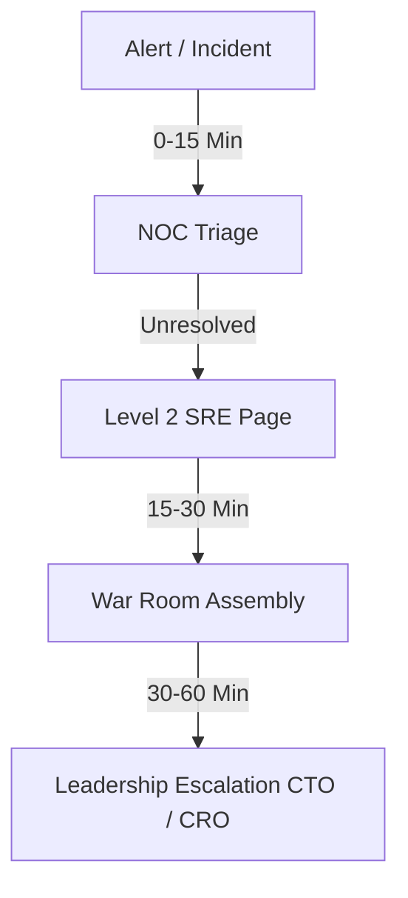
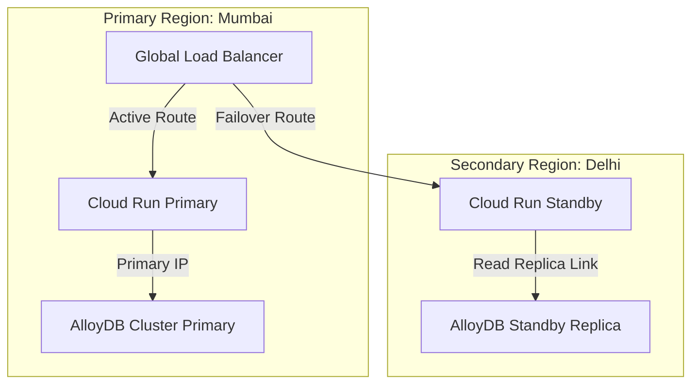
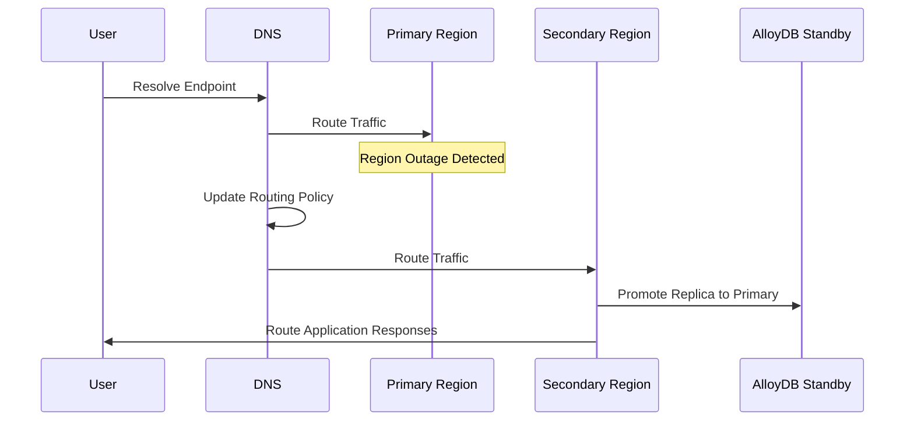
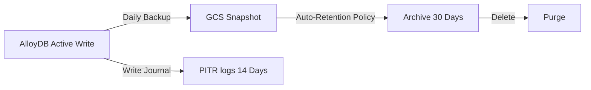

# AAR-DR-001: Project AAROHAN Disaster Recovery & Business Continuity Plan

---

## 1. Cover Page

* **Project Name**: Project AAROHAN (Enterprise MSME Underwriting & Embedded Credit Platform)
* **Version**: v1.0.0
* **Document Version**: v1.0.0
* **Classification**: CONFIDENTIAL - BANK OPERATIONAL RESILIENCE
* **Owner**: Disaster Recovery & Business Continuity Steering Group
* **Review Board**:
  - Head of Operational Risk: APPROVED
  - Chief Risk Officer (CRO): APPROVED
  - Lead Disaster Recovery SRE: APPROVED

---

## 2. Executive Summary

This document details the Disaster Recovery (DR) and Business Continuity Plan (BCP) for Project AAROHAN v1.0.0. The plan ensures that critical banking services are restored within acceptable limits during disruptions, mitigating operational risks and ensuring regulatory compliance.

---

## 3. Purpose

The purpose of this document is to establish a structured framework and set of procedures to protect and recover Project AAROHAN operations in the event of an infrastructure outage, security breach, or regional disaster on Google Cloud.

---

## 4. Scope

This plan covers all critical business services, relational data storage, analytical pipelines, document vaults, networking bridges, and security endpoints associated with the Project AAROHAN production environment.

---

## 5. Business Continuity Objectives

* **Minimize Financial Exposure**: Restrict revenue impact from platform downtime.
* **Maintain Regulatory Alignment**: Adhere to RBI guidelines for banking operations continuity.
* **Protect Public Trust**: Prevent brand damage through rapid recovery communication.

---

## 6. Disaster Recovery Objectives

* **Recovery Time Objective (RTO)**: <= 4 Hours for Tier 1 services.
* **Recovery Point Objective (RPO)**: <= 24 Hours (cold backups) / <= 10 Minutes (replication lag).
* **Maximum Tolerable Downtime (MTD)**: 12 Hours.
* **Service Priority Classification**:
  - **Tier 1 (Critical)**: Onboarding, Consent, GST, AA, FHC, Credit Decisioning, OCEN-ULI.
  - **Tier 2 (Highly Important)**: CAM Generation, RM Workspace.
  - **Tier 3 (Operational/Deferred)**: Executive Dashboard, Portfolio Analytics.

---

## 7. Critical Business Services

* **MSME Onboarding**: Customer registration and verification.
* **Financial Health Card**: Scoring engine processing.
* **AI Credit Decision**: Automated underwriting evaluation.
* **CAM Generation**: Credit Assessment Memorandum compilation.
* **Relationship Manager Workspace**: Task and lead management dashboard.
* **Executive Dashboard**: Corporate KPI analytics portal.
* **Early Warning System**: Risk alerts and watchlist monitoring.
* **Portfolio Intelligence**: Long-term risk analytics.
* **DPI Integrations**: External connectors for CKYC, MCA, EPFO, and TReDS.

---

## 8. Risk Assessment

* **Cloud Region Failure**: High impact, low likelihood. Mitigation: Multi-region failover.
* **Database Failure**: High impact. Mitigation: Active-active cross-zone replication.
* **Storage Failure**: Medium impact. Mitigation: GCS dual-region geo-replication.
* **Network Failure**: Medium impact. Mitigation: VPC serverless connectors and redundant load-balancing configurations.
* **API Gateway Failure**: High impact. Mitigation: Multi-region DNS traffic routing.
* **AI Service Failure**: Medium impact. Mitigation: Local rules-based decision engine fallbacks.
* **Identity Service Failure**: High impact. Mitigation: Session caching and AD replica nodes.
* **Security Breach & Ransomware**: High impact. Mitigation: Secure backups and access locks.
* **Data Corruption**: High impact. Mitigation: Point-in-Time Recovery (PITR).
* **Insider Threat**: High impact. Mitigation: Unified access reviews and immutable logs.

---

## 9. Business Impact Analysis (BIA)

Outages of Tier 1 services directly block borrower onboarding and loan processing pipelines, causing significant compliance, reputation, and financial risks.

---

## 10. Google Cloud Resilience Strategy

* **Cloud Run**: Multi-region deployment with traffic routed to alternative regions if the primary region goes down.
* **AlloyDB**: Cross-zone replication (HA configuration) and automated point-in-time recovery logs.
* **BigQuery**: Geo-replicated datasets.
* **Cloud Storage**: Dual-region buckets (`asia-south1` and `asia-south2`).
* **Secret Manager**: Geo-replicated secret stores.
* **Pub/Sub & Eventarc**: Global topics automatically route events around local zone failures.
* **Vertex AI**: Multi-region endpoint routing.
* **Cloud Monitoring & Logging**: Multi-project sinks archive logs safely.

---

## 11. Backup Strategy

* **AlloyDB Database**: Automatic daily backups retained for 30 days. Log journaling allows Point-in-Time Recovery (PITR) to any second within the past 14 days.
* **Cloud Storage Buckets**: Dual-region buckets auto-sync.
* **Configuration & Secrets**: Automated nightly exports of Secret Manager versions.

---

## 12. Restore Procedures

Restore procedures must be validated quarterly using sandbox environments.

---

## 13. Database Recovery

To perform a database restore from backup:
```bash
gcloud alloydb backups restore --cluster=aarohan-restored-db --backup=aarohan-backup-20260708 --region=asia-south1
```

---

## 14. Infrastructure Recovery

Infrastructure deployment uses terraform scripts stored in secure repository zones.

---

## 15. Application Recovery

Redeploy Cloud Run containers from GCP Artifact Registry to the secondary region if the primary region experiences a prolonged outage.

---

## 16. AI Service Recovery

If Vertex AI endpoints are unresponsive, route credit scoring requests to a backup rule-based engine running locally in the container.

---

## 17. Identity Recovery

Sync Active Directory replica nodes to restore IAM validations.

---

## 18. Network Recovery

Switch Cloud DNS routing policies to failover targets.

---

## 19. Secret Recovery

Re-import backed-up secret versions from secure vaults to Secret Manager.

---

## 20. Security Incident Recovery

Isolate infected subnets, rotate all secrets, and restore clean database states from clean snapshots.

---

## 21. Communication Plan

* **Internal**: Page SRE, NOC, and Product Owners.
* **External**: Issue public system status pages via the corporate helpdesk.

---

## 22. Escalation Matrix



---

## 23. Roles & Responsibilities

* **Incident Commander**: Coordinates recovery actions and runs the war room.
* **SRE Lead**: Redirects traffic and monitors service restoration.
* **Communications Coordinator**: Manages internal and external status updates.

---

## 24. DR Testing Strategy

* **Tabletop Simulations**: Conducted twice a year.
* **Active Failover Testing**: Executed annually during low-traffic windows.

---

## 25. Annual Review Process

Review this DR/BCP plan annually. Update contact lists, regional endpoints, and recovery metrics.

---

## 26. Operational Checklists

- [ ] Verify that database backups completed successfully.
- [ ] Test secondary region serverless connectivity.
- [ ] Confirm alert notification paths are active.

---

## 27. Appendix

### Disaster Recovery Architecture Diagram


### Failover Flow Diagram


### Backup Lifecycle Diagram


### Recovery Timeline Diagram
```mermaid
gantt
    title P1 Incident Recovery Timeline
    dateFormat  m
    axisFormat %M
    section Phases
    Incident Detected :active, 0, 5m
    Triage & Classify :active, 5m, 15m
    War Room & Failover Action :active, 15m, 60m
    Database Restore / Replica Promote :active, 60m, 120m
    Validation & DNS Update :active, 120m, 180m
    Service Restored :active, 180m, 240m
```
