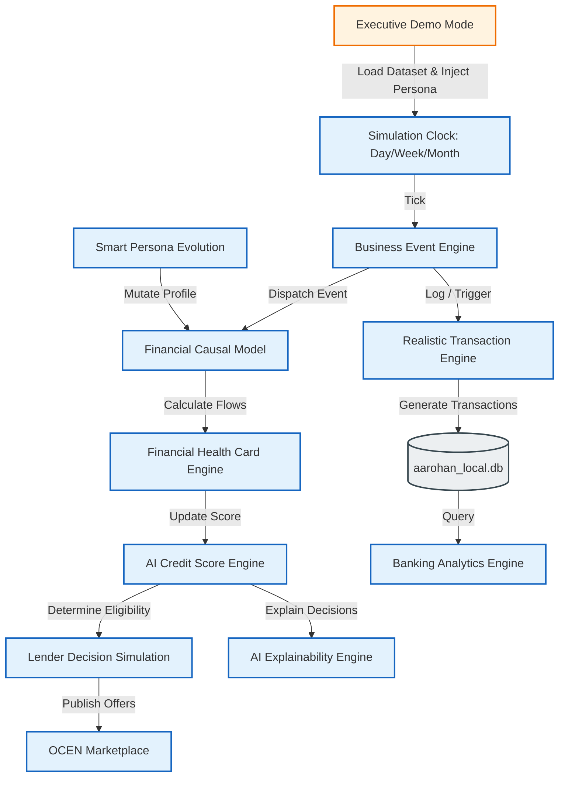
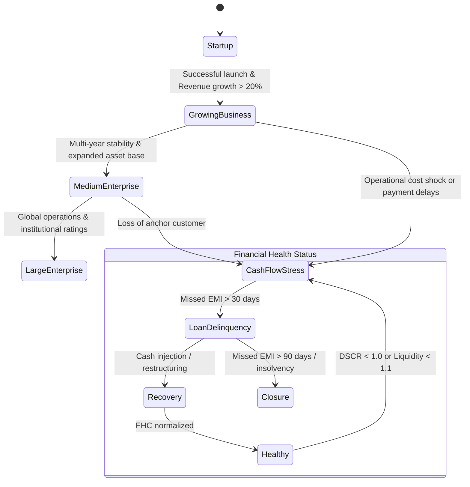

# AAR-ESE-007: Project AAROHAN Enterprise Simulation Engine (ESE) & Enterprise Digital Banking Twin — Sprint 2 Implementation Plan

**Document Classification**: Enterprise Architecture Blueprint  
**Sprint**: ESE Sprint 2 of 5  
**Version**: 1.0  
**Status**: 🟡 SPRINT PLANNING DRAFT FOR REVIEW  
**Date**: July 8, 2026  
**Platform**: Project AAROHAN Enterprise Digital Banking Twin v3.0  

---

## 1. Executive Summary

This document establishes the official implementation plan baseline for **Sprint 2** of the **Enterprise Simulation Engine (ESE)**, transforming it from a synthetic data seeder into a **Living Enterprise Digital Banking Twin**. 

The Digital Banking Twin functions as a high-fidelity, closed-loop simulation of the entire MSME lending ecosystem, modelling the complex causal relationships between transaction histories, regulatory filings, banking operations, AI-driven underwriting engines, and digital public infrastructure (DPI), all while maintaining total isolation from production environments. 

---

## 2. Dynamic Architecture: The Living Twin

To achieve a realistic simulation, ESE Sprint 2 implements a core loop driven by a unified simulation clock, a causal engine, and an event propagation bus. The following architecture diagram shows the conceptual integration:



---

## 3. Enterprise Improvement 1: Business Event Engine

The **Business Event Engine (BEE)** implements an asynchronous event broker inside `services/ese-core/` that handles propagation of business activities to downstream services.

### 3.1 Event Schema
Every event conforms to a standardized JSON schema:

```json
{
  "event_id": "evt_981247012_abc",
  "event_type": "GST_RETURN_FILED",
  "timestamp": "2026-07-08T14:36:51Z",
  "persona_id": "per_textile_001",
  "payload": {
    "reporting_period": "2026-06",
    "reported_turnover": 4500000.00,
    "cgst_paid": 405000.00,
    "sgst_paid": 405000.00,
    "filing_delay_days": 0
  }
}
```

### 3.2 Propagation Chain
When an event occurs, the BEE executes handlers sequentially or asynchronously:

1. **GST_RETURN_FILED** or **NEW_INVOICE_RAISED**
   - Updates `GST Turnover` in the customer profile.
2. **Turnover Updated**
   - Recalculates projected `Revenue` and updates monthly records.
3. **Cash Flow Updated**
   - Modifies `Operating Cash Flow` (OCF) and bank ledger balances.
4. **Financial Health Card Recalculated**
   - Triggers re-computation of liquidity, leverage, efficiency, and DSCR.
5. **Credit Score Updated**
   - Triggers execution of the AI Credit Model, adjusting credit score and risk grade.
6. **OCEN Loan Eligibility Updated**
   - Updates borrower limits in the simulated OCEN registry.
7. **Loan Offers Regenerated**
   - Re-evaluates lender policies and populates active marketplace offers.
8. **Executive Dashboard Refreshed**
   - Invalidates Redis/in-memory caches to update analytics immediately.

### 3.3 Event Matrix

| Event Type | Source System | Target Systems / Effects |
| :--- | :--- | :--- |
| `GST_RETURN_FILED` | GSTN (Simulated DPI) | Recalculate Turnover, Cash Flow, Financial Health Card (FHC). |
| `GST_PAYMENT_DELAYED` | GSTN (Simulated DPI) | Apply penalty to Cash Flow, trigger FHC risk flag, degrade Credit Score. |
| `NEW_INVOICE_RAISED` | Trade Receivable System | Update accounts receivable, increase projected Cash Flow. |
| `EMI_PAID` | Core Banking System | Deduct cash from bank ledger, update loan outstanding, update FHC. |
| `EMI_MISSED` | Core Banking System | Trigger immediate default flag, recalculate Credit Score (-50 points), generate NPA alert. |
| `SALARY_PROCESSED` | ERP Payroll Module | Deduct cash ledger, verify payroll consistency for FHC operating stability score. |
| `EPFO_FILING_SUBMITTED` | EPFO (Simulated DPI) | Verify social security compliance status; positively influences credit scoring. |
| `EPFO_DEFAULT` | EPFO (Simulated DPI) | Degrade compliance grade, freeze credit offer validation. |
| `MCA_FILING_UPDATED` | MCA21 (Simulated DPI) | Update business age, director profiles, and shareholder equity. |
| `RBI_FRAUD_ALERT` | RBI Central Fraud Registry | Instantly suspend all active loan offers; mark customer status as blacklisted. |
| `NEW_LOAN_SANCTIONED` | Lender Core Engine | Increment debt ledger, credit cash balance, update portfolio total outstanding. |
| `LOAN_CLOSED` | Lender Core Engine | Adjust credit history, release collateral registry flags, improve FHC leverage ratio. |

---

## 4. Enterprise Improvement 2: Financial Causal Model

The **Financial Causal Model (FCM)** establishes deterministic mathematical linkages between cash transactions and credit availability. 

```
[GST Turnover] -> [Revenue] -> [Operating Cash Flow] -> [Bank Balance] -> [DSCR] -> [FHC] -> [AI Credit Score] -> [Loan Recommendation] -> [Marketplace Offers]
```

### 4.1 Causal Equations and Ratios

1. **Revenue ($R_m$) and Turnover ($T_m$) Validation**:
   $$R_m = T_{gst, m} \cdot (1 - \delta_{underreport}) + C_{cash, m}$$
   *Where $\delta_{underreport}$ is the persona's tax compliance discrepancy rate, and $C_{cash}$ is cash-based sales.*

2. **Operating Cash Flow ($OCF_m$)**:
   $$OCF_m = R_m - \text{COGS}_m - \text{OpEx}_m - T_{tax, m} - \Delta\text{NWC}_m$$
   *Where $\Delta\text{NWC}$ is the change in Non-Cash Working Capital (Receivables + Inventory - Payables).*

3. **Bank Balance ($B_t$) Progression**:
   $$B_t = B_{t-1} + \sum (\text{Customer Collections}) - \sum (\text{Payments}) - \text{EMI}_t$$

4. **Debt Service Coverage Ratio ($DSCR_m$)**:
   $$DSCR_m = \frac{OCF_m + \text{InterestExpense}_m}{\text{PrincipalPaid}_m + \text{InterestExpense}_m}$$

5. **Financial Health Card (FHC) Multi-Score**:
   The FHC is scored out of 100 based on four weighted domains:
   $$\text{FHC} = 0.30 \cdot S_{liquidity} + 0.25 \cdot S_{profitability} + 0.25 \cdot S_{leverage} + 0.20 \cdot S_{debt\_service}$$
   - $S_{liquidity} = f(\text{Current Ratio} = \frac{\text{Current Assets}}{\text{Current Liabilities}})$
   - $S_{profitability} = f(\text{Net Margin} = \frac{\text{Net Income}}{\text{Revenue}})$
   - $S_{leverage} = f(\text{Debt-to-Equity} = \frac{\text{Total Debt}}{\text{Equity}})$
   - $S_{debt\_service} = f(DSCR)$

6. **AI Credit Score ($CS$) Calculation**:
   $$CS = 300 + 600 \cdot \left[ 0.40 \cdot \left(\frac{\text{FHC}}{100}\right) + 0.30 \gamma_{repayment} + 0.15 \gamma_{gst\_consistency} - 0.15 \text{FraudFlag} \right]$$
   *Where $\gamma_{repayment}$ is the historical repayment success rate ($[0,1]$), $\gamma_{gst\_consistency}$ is the GST filing frequency ratio ($[0,1]$), and $\text{FraudFlag} \in \{0, 1\}$.*

7. **Loan Recommendation Limit ($L_{max}$)**:
   $$L_{max} = \min \left( \frac{OCF_{average} \cdot (DSCR_{target} - 1)}{\text{Monthly Repayment Factor}}, \text{MaxCap}_{\text{industry}} \right)$$

---

## 5. Enterprise Improvement 3: Realistic Transaction Engine

The simulation replaces randomized transaction seeding with a **Structured Business Transaction Engine (SBTE)**.

### 5.1 Business Transaction Profiles
Each simulated business persona maps to a transaction template generating consistent chronological ledger logs:

- **Revenue / Customer Collections**: Periodic deposits (invoices paid within net-30/60/90 days).
- **Vendor Payments**: Outflows matching supply chain cycles, occurring on designated days of the month.
- **Payroll**: Processed deterministically on the 1st to 5th of each month.
- **GST Payments**: Disbursed on the 20th of the month matching quarterly/monthly GST rules.
- **Utility and Rent**: Recurring fixed expenditures occurring on the 10th of every month.
- **Loan Repayments**: Automated debit matching EMI schedules on the 5th of each month.
- **Seasonal Variations**: Multipliers applied to revenue based on industry seasonality indexes (e.g., Agriculture peak in Q3, Retail peak in Q4).

### 5.2 Chronological Timeline Consistency
A sliding-window event scheduler guarantees that cash balances never go negative unless overdraft privileges are active, matching real banking ledger mechanics.

---

## 6. Enterprise Improvement 4: Smart Persona Evolution

Business personas are dynamic and change state over time based on business performance, macroeconomic parameters, and simulated operational actions.



### 6.1 State Transition Triggers

- **Startup to Growing Business**: Requires 12 months of operations, consistent positive cash flow, and FHC > 65.
- **Healthy to Cash Flow Stress**: Triggered if a major customer delays payment by 60 days, forcing the liquidity ratio below 1.0.
- **Cash Flow Stress to Loan Delinquency**: Triggered automatically when the simulation clock passes the EMI due date by 30 days without payment.
- **Recovery**: Initiated if the business obtains a working capital loan injection, restructures liabilities, or receives vendor payments.

---

## 7. Enterprise Improvement 5: Lender Decision Simulation

The engine models multiple lending entities, each configured with specific policy rules, risk models, and target segments:

```
[Borrower Application] 
       │
       ├─> Public Sector Bank (Conservative, strict FHC, low interest rate 8.5%)
       ├─> Private Bank (Moderate risk, automated FHC validation, interest rate 10.5%)
       ├─> NBFC (High risk appetite, accepts lower FHC, interest rate 14.0%)
       ├─> FinTech (AI-driven, instant approval, customized risk-based pricing 12-18%)
       └─> Microfinance (Low-ticket size, focus on micro-entrepreneurs, interest rate 18-24%)
```

### 7.1 Lender Policy Matrix

| Lender Category | Target Credit Score | Min Business Age | Max Debt-to-Revenue | Interest Rate Range | Approval Turnaround |
| :--- | :--- | :--- | :--- | :--- | :--- |
| **Public Sector Bank** | $\ge 750$ | 3 Years | 30% | 8.5% – 9.8% | 15–30 Days |
| **Private Bank** | $\ge 700$ | 2 Years | 40% | 10.0% – 12.5% | 3–7 Days |
| **NBFC** | $\ge 620$ | 1 Year | 50% | 13.0% – 16.5% | 1–2 Days |
| **FinTech** | $\ge 580$ (or FHC $\ge 50$) | 6 Months | 60% | 12.0% – 18.0% | Real-time (<5 mins) |
| **Microfinance** | N/A (low ticket) | 3 Months | 70% | 18.0% – 24.0% | 1–3 Days |

---

## 8. Enterprise Improvement 6: AI Explainability Engine

To meet enterprise compliance, every automated credit decision, FHC valuation, and loan offer generated by the twin produces a **Deterministic Explainability Record (DER)**.

### 8.1 Schema for Explainable Decisions
```json
{
  "decision_id": "dec_8819024_xyz",
  "persona_id": "per_textile_001",
  "verdict": "REJECTED",
  "reasons": [
    {
      "factor": "DEBT_SERVICE_CAPACITY",
      "metric": "DSCR = 0.85",
      "description": "Operating cash flow is insufficient to cover current monthly debt service obligations. Minimum required DSCR is 1.20."
    },
    {
      "factor": "REGULATORY_COMPLIANCE",
      "metric": "EPFO_DEFAULT = True",
      "description": "Recent social security payment defaults indicate potential liquidity distress."
    }
  ],
  "mitigants": [
    "Secure credit guarantee scheme cover",
    "Reduce short-term bank overdraft utilization"
  ],
  "credit_appraisal_memorandum_summary": "The applicant exhibits weak debt-service capability due to rising inventory holding costs. Recommend rejection until turnover velocity improves."
}
```

---

## 9. Enterprise Improvement 7: Executive Demonstration Mode

The Digital Banking Twin includes predefined, one-click demonstration scripts accessible via the Admin UI or Control API. These demos configure the system state to show specific business paths.

### 9.1 Predefined Journeys

1. **IDBI Board Demo**
   - **Persona**: Medium Textile Manufacturer
   - **Scenario**: Seamless growth story from startup to mid-corporate showing automated limit increases.
   - **Dashboard**: Global portfolio indicators showcasing high-yield, low-NPA growth.
2. **Credit Committee Demo**
   - **Persona**: Engineering Services Exporter
   - **Scenario**: High credit quality with fluctuating seasonal cash flows; explains how the AI evaluates volatility without rejecting the applicant.
3. **MSME Success Story**
   - **Persona**: Women-led Agro Processing Unit
   - **Scenario**: Progresses from micro-borrower to formal private bank borrower, demonstrating financial inclusion.
4. **Fraud Investigation**
   - **Persona**: Retail Distributor
   - **Scenario**: Injects fake invoices and tax filing discrepancies; highlights system response when a fraud alert is triggered by the RBI registry.
5. **Portfolio Review**
   - **Scenario**: Simulates macroeconomic cash flow stress across 500 MSMEs, illustrating risk mitigation and NPA provisioning.

---

## 10. Enterprise Improvement 8: Banking Analytics Engine

The Admin Control API is enhanced with a comprehensive metrics aggregator providing real-time data visualisations of the simulated bank portfolio.

### 10.1 Analytics Indicators
- **Portfolio Outstanding**: Aggregate value of all active lending books.
- **Approval Rate**: Percentage of processed loan requests approved within the selected timeline window.
- **NPA Ratio (Non-Performing Assets)**: Ratio of loans with missed payments $>90$ days.
- **Fraud Incidents**: Count of active fraud alerts and blacklisted entities.
- **Average Loan Size & Processing Time**: Tracking processing speeds across public banks vs. fintechs.
- **Geographic & Sector Lending Distributions**: Segmentation of loans by State, District, Sector (Manufacturing, Agri, Retail), and MSME classification (Micro, Small, Medium).

---

## 11. Enterprise Improvement 9: Simulation Timeline

The Twin implements a chronological tick clock that manages time-dependent events.

```
[Start Simulation] -> [Set Clock: Daily/Weekly/Monthly] -> [Trigger Clock Ticks]
                                                                │
   ┌────────────────────────────────────────────────────────────┘
   ▼
[Update Transaction Ledger] -> [Process Filings] -> [Apply Interest / EMIs] -> [Refresh Analytics]
```

### 11.1 Clock Control Parameters
- **`POST /ese/control/clock/tick`**: Advances the clock by a specified step size (e.g., `+1 day`, `+1 month`).
- **`POST /ese/control/clock/set`**: Configures the simulation date directly.
- **Automated Chronological Calculations**: Each tick runs downstream routines to generate transactions, process overdue interest, apply compliance statuses, and update reports.

---

## 12. Digital Banking Twin Certification

### 12.1 Regulatory and Architecture Isolation
To maintain strict system boundary safety, the Digital Banking Twin runs under the following constraints:
- **Sandbox Environment Isolation**: All network calls targeting downstream integrations (GSTN, EPFO, Account Aggregators, Lenders) are intercepted and redirected to simulated local endpoints.
- **Database Separation**: Read/write actions are confined to `aarohan_local.db` or dedicated mock files.
- **Production Safety Safeguard**: The adapter layer is configured to check runtime environments; if a production config is detected, the simulation engine is disabled automatically.

---

## 13. Proposed Changes

To support these features, the Sprint 2 deliverables are mapped to the following components:

### 13.1 [MODIFY] [admin_api.py](file:///d:/SAMUEL/HACK%202%20SKILL/IDBI%20MSME/Project%20AAROHAN/services/ese-core/admin_api.py)
Update the control endpoints to support the simulation clock, event triggers, executive demos, and portfolio analytics:
- Add POST `/ese/control/clock`
- Add POST `/ese/control/demo-journey`
- Add GET `/ese/control/analytics`

### 13.2 [NEW] [causal_model.py](file:///d:/SAMUEL/HACK%202%20SKILL/IDBI%20MSME/Project%20AAROHAN/services/ese-core/causal_model.py)
Implement calculations for the Financial Causal Model, managing calculations from GST turnover to credit limits and FHC scores.

### 13.3 [NEW] [event_engine.py](file:///d:/SAMUEL/HACK%202%20SKILL/IDBI%20MSME/Project%20AAROHAN/services/ese-core/event_engine.py)
Implement the Business Event Engine to manage event registration, dispatching, and downstream propagation.

### 13.4 [NEW] [lenders.py](file:///d:/SAMUEL/HACK%202%20SKILL/IDBI%20MSME/Project%20AAROHAN/services/ese-core/lenders.py)
Implement lender profiles, underwriting policies, risk pricing formulas, and automated decision-making.

### 13.5 [NEW] [clock.py](file:///d:/SAMUEL/HACK%202%20SKILL/IDBI%20MSME/Project%20AAROHAN/services/ese-core/clock.py)
Implement the simulation clock control loop and chronological event scheduler.

---

## 14. Verification Plan

### 14.1 Automated Tests
Verify causal calculations and event triggers:
- `pytest tests/ese/test_causal_model.py` (Validates DSCR and Credit Score formulas)
- `pytest tests/ese/test_event_engine.py` (Validates cascading event propagation)
- `pytest tests/ese/test_simulation_clock.py` (Validates daily/monthly progression ticks)

### 14.2 Manual Verification
Use the Control Center API to run one-click journeys and check the updated stats on the Executive Dashboard:
1. Trigger `/ese/control/demo-journey` with `IDBI_BOARD_DEMO`.
2. Retrieve portfolio analytics via `/ese/control/analytics` to verify that performance indicators and metrics are updated.
