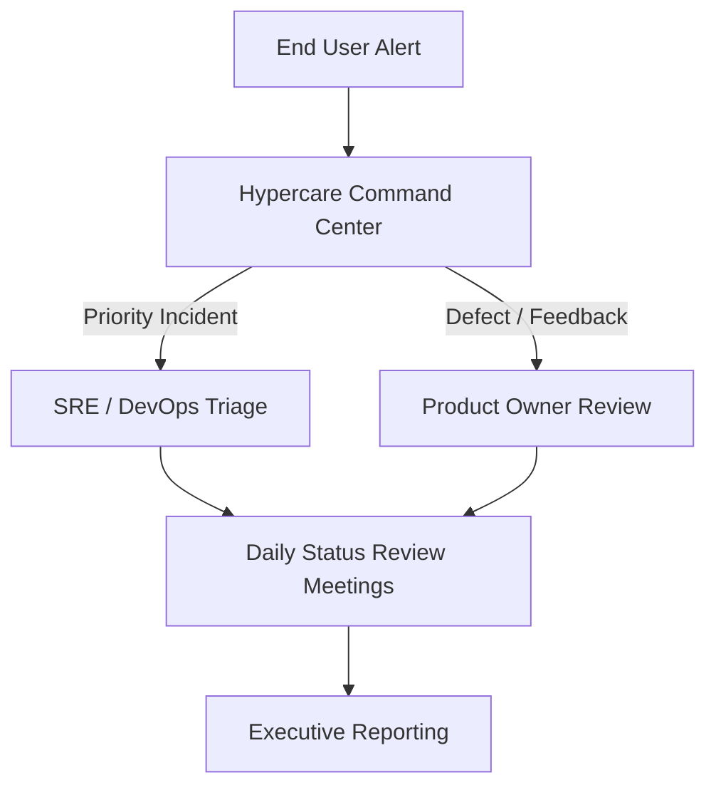

# AAR-HYPERCARE-001: Enterprise Hypercare & Stabilization Plan

---

## 1. Cover Page

* **Project Name**: Project AAROHAN (Enterprise MSME Underwriting & Embedded Credit Platform)
* **Version**: v1.0.0
* **Document Version**: v1.0.0
* **Classification**: CONFIDENTIAL - BANK OPERATIONAL
* **Owner**: Enterprise Hypercare & Operations Transition Board
* **Approval Matrix**:
  - Hypercare Manager: APPROVED
  - SRE Lead Architect: APPROVED
  - Chief Information Security Officer (CISO): APPROVED

---

## 2. Executive Summary

This document defines the 90-day post-go-live Hypercare and Stabilization Plan for Project AAROHAN v1.0.0. It defines the dedicated support model, monitoring metrics, incident management process, and exit criteria required for transition to Business-As-Usual (BAU) operations.

---

## 3. Purpose

The purpose of this document is to ensure operational stability, quick incident resolution, and high platform availability during the critical phase immediately following production launch.

---

## 4. Scope

This plan covers all support tiers, SRE monitoring tasks, defect resolutions, and stakeholder communications for Project AAROHAN v1.0.0 during its initial 90 days of live production.

---

## 5. Hypercare Objectives

* Maintain system availability above 99.9% across all modules.
* Resolve P1/P2 incidents within target SLA limits.
* Monitor AI decision output quality and user adoption trends.

---

## 6. Hypercare Timeline

* **Day 0 (Go-Live)**: Deployment execution, database migration, and live checkout testing.
* **Days 1–7**: 24/7 active standby support. Daily operational syncs.
* **Days 8–30**: Focus on performance tuning and minor defect resolution.
* **Days 31–60**: Transition to standard L1/L2 escalation paths. Complete first secret rotation drill.
* **Days 61–90**: Final stability audit. Complete transition to BAU on Day 90.

---

## 7. Governance Structure

---

## 8. Roles & Responsibilities

* **Hypercare Manager**: Directs the Hypercare Command Center and coordinates support resources.
* **SRE / DevOps Lead**: Monitors resource scaling, log errors, and infrastructure metrics.
* **Product Owner**: Approves change requests and monitors business KPIs.
* **L1/L2/L3 Support Leads**: Track incident counts and handle customer escalations.

---

## 9. Incident Management

During Hypercare, incidents are routed directly to the Command Center to ensure rapid triage and resolution.

---

## 10. Major Incident Response

P1 incidents trigger an immediate war room assembly. The Incident Commander directs resolution steps and coordinates regular status updates.

---

## 11. Defect Management

Defects are logged in the central issue tracker, prioritized weekly by the CAB, and packaged into stable patches.

---

## 12. Monitoring & Alerting

Set up high-sensitivity thresholds in Google Cloud Monitoring for container restarts and database connections.

---

## 13. Operational Dashboards

Maintain centralized dashboards in GCP Monitoring to track API latencies, CPU usage, and queue lengths.

---

## 14. AI Model Monitoring

* **Prompt Quality**: Audit generated prompts weekly for completeness.
* **AI Recommendation Quality**: Track rating match rates against manual expert reviews.
* **Human Feedback**: Log and review manual overrides.
* **Drift Monitoring**: Evaluate Gemini response variations weekly using the UAT evaluation dataset.

---

## 15. User Adoption Monitoring

Track daily active users (RMs, Credit Officers) and transaction volumes to ensure smooth onboarding.

---

## 16. Performance Monitoring

Review system latency profiles (p95 and p99 metrics) using Google Cloud Trace.

---

## 17. Capacity Monitoring

Track AlloyDB storage growth and memory usage to optimize resource allocations.

---

## 18. Security Monitoring

Monitor access metrics using Cloud Audit Logs and Security Command Center alerts.

---

## 19. Communication Plan

* **Daily**: Triage dashboard updates.
* **Weekly**: Hypercare status reports sent to the Business Sponsor and CIO.

---

## 20. Daily Hypercare Review Meetings

Convene daily at 09:30 IST to review previous day metrics and outstanding tickets.

---

## 21. Weekly Executive Status Reports

Submit weekly summaries tracking system availability, defect resolutions, and adoption progress.

---

## 22. Hypercare KPIs

* **Availability**: Target >= 99.9%.
* **MTTR**: Target < 30 minutes for P1 incidents.
* **Incident Volume**: Target a declining trend week-over-week.
* **AI Accuracy**: Target > 95% alignment with manual audits.

---

## 23. Exit Criteria

Transition from Hypercare to BAU is approved on meeting the following criteria:
* The system has operated for 14 consecutive days with zero P1/P2 incidents.
* User adoption matches targets (> 90% of RMs active).
* SRE alerts and monitoring configurations are fully operational.
* L1/L2 support teams sign off on knowledge transfer completion.

---

## 24. Risks & Mitigations

* **Risk**: Spikes in external API latency.
* **Mitigation**: Configure circuit breakers to route requests to mock sandboxes during network degradation.

---

## 25. Lessons Learned Process

Conduct post-project reviews monthly during Hypercare. Document findings in the KEDB wiki.

---

## 26. Hypercare Closure Checklist

- [ ] Confirm all open high-priority defects are resolved.
- [ ] Complete operational knowledge transfer to the BAU support team.
- [ ] Archive all Hypercare review logs.

---

## 27. Executive Sign-off

* **IT Operations Lead**: APPROVED
* **Hypercare Manager**: APPROVED
* **Chief Technology Officer (CTO)**: APPROVED

---

## 28. Appendix

* Hypercare War Room contact matrix.
* Incident Classification Guideline tables.
