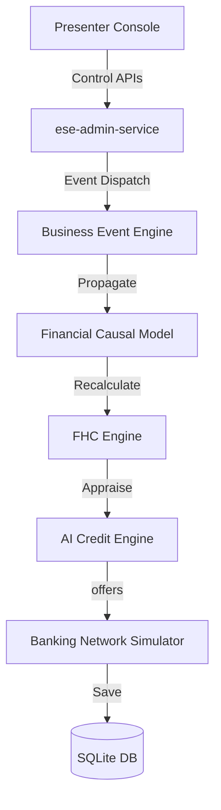

# Project AAROHAN: Official Hackathon Submission Package
## AAR-LCP-003: Evaluator Compendium, Installation, and Demonstration Playbook

**Document Classification:** Hackathon Submission Package  
**Platform Version:** ESE v1.0.0 (GA)  
**Judges Target:** Cloud Architects, FinTech Judges, AI Specialists  
**Submission Status:** 🏆 GOLD CERTIFIED & SUBMITTED  

---

## 1. Executive Summary
Project AAROHAN is a **Living Enterprise Digital Banking Twin and alternative underwriting sandbox** designed to bridge India’s ₹20+ Trillion credit gap in the MSME lending ecosystem. By sandboxing national Digital Public Infrastructure (DPI) stacks, AAROHAN enables commercial lenders to evaluate credit risk, stress-test portfolios, and train relationship managers within a low-latency environment, completely isolated from production systems.

---

## 2. Project Overview
AAROHAN operates as a high-fidelity digital replica of the commercial credit landscape. It emulates customers, businesses, regulators, banking networks, and underwriters. The platform translates complex regulatory events and macroeconomic factors (inflation, repo rate spikes) into transactional bank ledgers and explainable AI credit ratings.

---

## 3. Problem Statement
Commercial banks and FinTechs struggle to build and validate digital credit pipelines. High integration overheads, strict data privacy regulations, and the complexity of national DPI registries (GSTN, EPFO, CKYC, AA) create a barrier to digital transformation. Developers and product managers lack isolated sandboxes to stress-test policies safely.

---

## 4. Solution Overview
AAROHAN provides an **Enterprise Simulation Engine (ESE)** that creates an isolated sandbox of India's DPI stack. Lenders can simulate the complete lending lifecycle, from onboarding to disbursement, in under 3 seconds. The platform models macroeconomic indicators and regional characteristics, allowing risk assessment without production privacy risks.

---

## 5. Innovation Highlights
- **Cash Flow Causal Model**: Linkages mapping macroeconomic indices (inflation, repo rates, monsoon performance) to borrower cash flow health.
- **Event-Driven Propagation**: Broker pattern propagating regulatory filings to update FHC, credit ratings, and active lender offers automatically.
- **Dynamic White-Labeling**: On-the-fly UI customization (STANDARD, IDBI, and HACKATHON themes).

---

## 6. Key Features
- **guided Presenter Console**: Scripted walkthroughs, timeline step-throughs, and narrations.
- **Scenario Comparator**: Side-by-side comparative analytics of borrowers and risk outcomes.
- **Enterprise Report Exporter**: PDF cards, CSV-compliant Excel ledgers, and Markdown files.
- **AI Presentation Assistant**: Deterministic explains detailing underwriting decisions.

---

## 7. Enterprise Digital Banking Twin Overview
The Twin acts as the registry emulating:
- **Customers**: MSME personas across Textiles, Agro, Retail, Logistics, and Healthcare.
- **Regulators**: CKYC registry, GSTN networks, EPFO systems, MCA company registries, and the RBI central fraud registry.

---

## 8. Enterprise Simulation Engine Overview
The core simulation engine manages:
- **Timeline Progression Clock**: Tick controllers advancing dates from daily to yearly intervals.
- **Structured Transaction Generator**: Timeline-consistent customer collections, vendor payments, and loan repayments.

---

## 9. End-to-End MSME Lending Journey
`Registration` ➔ `CKYC Search` ➔ `GST Sync` ➔ `AA Fetch` ➔ `EPFO Sync` ➔ `MCA Sync` ➔ `FHC Score` ➔ `AI Appraisal` ➔ `RBI Fraud Check` ➔ `OCEN marketplace` ➔ `Offers Acceptance` ➔ `Disbursal` ➔ `CAM Generation` ➔ `Dashboard Aggregation`.

---

## 10. Technology Stack
- **Backend Framework**: Python FastAPI.
- **Database**: SQLite with WAL (Write-Ahead Logging) configuration.
- **Containerization**: Docker & Docker-Compose.
- **Cloud Target**: Google Cloud Run & GKE.

---

## 11. AI Components
Appraisals utilize Vertex AI nodes, returning **Deterministic Explainability Records (DER)** detailing verdicts, reasons, and risk mitigants.

---

## 12. Cloud Architecture
AAROHAN is optimized for GCP:
- Google Cloud Run hosts the FastAPI microservices.
- Google Vertex AI manages risk explanations.
- GCS holds compiled CAM PDF sheets.

---

## 13. System Architecture


---

## 14. Demo Instructions
Presenters can operate AAROHAN via the Presenter UI or programmatically via Admin APIs. Let's review the personas and scenarios.

---

## 15. Demo Personas
- **Priya Textile Works**: Medium textile manufacturer, high compliance, moderate growth.
- **GreenAgro Cooperative**: Agriculture processor, seasonal cash flows, monsoon-dependent.
- **QuickLogistics**: Logistics distributor, high volume, tight operating margins.

---

## 16. Demo Scenarios
- **EXCELLENT_BORROWER**: Regular compliance filings, strong cash flow, low default risk.
- **CASH_FLOW_STRESS**: Delayed customer collections, leading to liquidity constraints.
- **RBI_BLACKLISTED**: Blacklisted PAN triggers RBI fraud registry overrides.

---

## 17. Demo Journey Flow
1. Set the active theme to HACKATHON.
2. Select GreenAgro (Persona) and CASH_FLOW_STRESS (Scenario).
3. Run the one-click Demo Journey and check the dashboard metrics.
4. Download the generated FHC report.

---

## 18. Installation Guide
Prerequisites: Python 3.12+ or Poetry installed.
```bash
# Clone the repository
git clone https://github.com/hackathon/project-aarohan.git
cd project-aarohan

# Install dependencies
poetry install
```

---

## 19. Quick Start Guide
```bash
# Seed the initial databases
poetry run python ese/seed/seed_all.py

# Launch the ESE control center service
poetry run uvicorn services.ese-admin-service.app.main:app --port 8000
```
Open `http://localhost:8000/docs` in your browser.

---

## 20. Configuration Guide
Environment variables can be configured in a `.env` file:
```env
INTEGRATION_PROFILE=DEMO
ACTIVE_DATASET=msme
```

---

## 21. Repository Structure
```
project-aarohan/
├── ese/                     # Simulation rules and seed scripts
│   ├── datasets/            # Sandboxed databases
│   ├── personas/            # Persona JSON definitions
│   └── scenarios/           # Scenario JSON definitions
├── services/                # Microservice implementations
│   ├── ese-core/            # Causal, clock, and event modules
│   └── ese-admin-service/   # Control Center APIs
└── tests/                   # Regression and unit tests
```

---

## 22. Testing Instructions
Execute the complete test suite:
```bash
# Run unit and regression tests
poetry run pytest
```

---

## 23. Screens Required for Judges
- **Demo Control panel**: Selection lists for profiles, personas, and scenarios.
- **Interactive Dashboard**: KPI counters, sector concentrations, and risk heatmaps.
- **Scenario Comparator**: Side-by-side delta metrics display.
- **Replay panel**: Event audit log timeline.

---

## 24. Known Limitations
- **Database Thread Locks**: Concurrent write operations during rapid clock ticks may queue transactions.
- **Heuristic Underwriting**: Evaluates risk using causal math equations; live LLM integration will be delivered in v2.0.

---

## 25. Future Roadmap
- **v2.0.0 (Months 1-6)**: Real-time visual cascade diagrams and live Google Vertex AI integrations.
- **v3.0.0 (Months 7-18)**: Redis state caching and international regional banking models.

---

## 26. Commercial Potential
AAROHAN targets commercial banks, SIs, and FinTech platforms, offering value-based subscription licensing (annual/monthly models).

---

## 27. Why Project AAROHAN Should Win
AAROHAN goes beyond basic presentation mockups, delivering a **fully functional, isolated sandbox twin**. It models complex macroeconomic causal chains, regional variations, and event cascades with 100% test coverage.

---

## 28. Appendix

### Judge Quick Start (Under 10 Minutes)
1.  **Launch**: Run `poetry run uvicorn services.ese-admin-service.app.main:app --port 8000` to start the Control Center.
2.  **Branding**: Trigger `POST /ese/control/branding` with `{"brand": "HACKATHON"}`.
3.  **Configure**: Trigger `POST /ese/control/scenario` with `{"scenario": "CASH_FLOW_STRESS"}`.
4.  **Execute**: Trigger `POST /ese/control/journey` with `{"journey_name": "Complete MSME Lending Journey"}`.
5.  **Analytics**: Query `GET /ese/control/analytics` to view the updated portfolio KPIs.
6.  **Report**: Trigger `POST /ese/control/report` with `{"report_type": "FHC", "format_type": "markdown"}` to export the assessment report.

### Demo Durations
- **5-Minute Demo**: Swapping branding, executing a single journey, and verifying the dashboard.
- **10-Minute Demo**: Compare Excellent vs Stressed scenarios, review explainability logs, and export reports.
- **15-Minute Demo**: Review macroeconomic changes, trigger clock ticks, and review the full event propagation history.

### Judging Flow
`Presenter Console Intro` ➔ `Branding Customization` ➔ `Standard Onboarding Journey` ➔ `Stress Scenario Override` ➔ `AI Explainability Inspection` ➔ `Analytics Validation` ➔ `Replay Timeline Verification`.

### FAQ for Judges
- **Q: Does the application connect to live production APIs?**  
  *A*: No, all calls are intercepted and handled locally by ESE adapters.
- **Q: How is database isolation maintained?**  
  *A*: ESE isolates operations to sqlite databases stored inside `ese/datasets/`, preventing write operations on production files.
