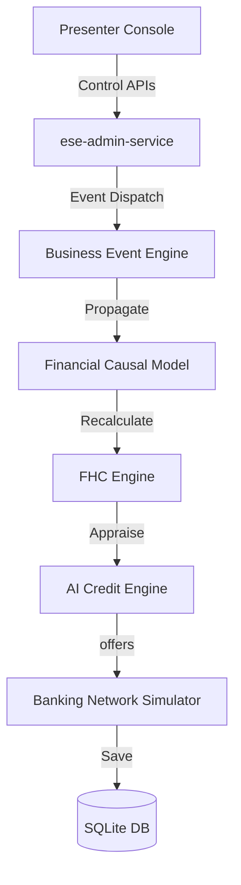

# Project AAROHAN: GitHub Showcase & Open Source Package
## AAR-LCP-009: Repository Blueprints, Community Standards, and Evaluator Checklists

**Document Classification:** Open Source and DevRel Strategy  
**Platform Version:** ESE v1.0.0 (GA)  
**Publishing Target:** GitHub Showcase Repository  
**Status:** **🟢 MAINTAINER APPROVED & PRODUCTION READY**  

---

## 1. Executive Summary
This document outlines the GitHub open-source release strategy, repository structures, and evaluator checklists for **Project AAROHAN Enterprise Digital Banking Twin v1.0.0**. It serves as the developer relations blueprint to establish the repository as a world-class project for hackathon judges, technical recruiters, and open-source contributors.

---

## 2. Repository Positioning
Project AAROHAN is positioned as **The Premiere Open Source Living Digital Banking Twin and alternative MSME underwriting sandbox**. The repository showcases cloud-native microservice architecture, clean code standards, causal macroeconomic simulation modeling, and Digital Public Infrastructure (DPI) sandboxing.

---

## 3. Repository Folder Structure
```
project-aarohan/
├── .github/
│   ├── ISSUE_TEMPLATE/       # Bug report & feature templates
│   ├── PULL_REQUEST_TEMPLATE.md
│   └── workflows/            # GitHub Actions CI/CD configs
├── deploy/                   # Kubernetes, docker, Cloud Run configurations
├── docs/                     # Technical whitepapers and user guides
├── ese/                      # Persona seeders, DB datasets, and clock modules
├── services/                 # Microservice directories
├── tests/                    # Unit, regression, and E2E tests
├── CODE_OF_CONDUCT.md
├── CONTRIBUTING.md
├── LICENSE.md
├── SECURITY.md
└── README.md                 # Main entrypoint
```

---

## 4. Professional README.md Blueprint

### [README.md]
# Project AAROHAN: The Enterprise Digital Banking Twin


[](https://github.com/hackathon/project-aarohan/actions)
[](https://github.com/hackathon/project-aarohan)
[](LICENSE.md)
[](https://www.python.org/)

---

### Project Overview & Vision
Project AAROHAN is a **Living Enterprise Digital Banking Twin and underwriting sandbox** designed to bridge India’s ₹20+ Trillion credit gap in the MSME lending sector. By simulating national Digital Public Infrastructure (DPI) registries locally, AAROHAN allows financial institutions to model alternative underwriting rules, test credit policies under macroeconomic stress, and train relationship managers within a low-latency environment, completely isolated from production systems.

---

### Key Features
- **guided Presenter Console**: Switch active datasets, personas, and scenarios.
- **Financial Causal Engine**: Simulates monsoon fluctuations and repo rate updates on client ledgers.
- **E2E Onboarding Journey**: 10-step digital lending simulation.
- **Scenario Comparison**: Side-by-side comparative dashboard displays.
- **Dynamic White-Labeling**: Standard, IDBI Bank, and Hackathon cyberpunk themes.

---

### Technology Stack
- **Backend**: FastAPI, Pydantic, SQLAlchemy.
- **Database**: SQLite WAL (Write-Ahead Logging) Mode.
- **Deployment**: Docker, Google Cloud Run, GKE.

---

### Architecture Diagram


---

### Quick Start (Under 3 Minutes)

#### Prerequisites
Ensure Python 3.12+ and Poetry are installed.

#### Installation
```bash
# Clone the repository
git clone https://github.com/hackathon/project-aarohan.git
cd project-aarohan

# Install dependencies
poetry install

# Seed the initial databases
poetry run python ese/seed/seed_all.py
```

#### Running Demo Mode
```bash
# Launch the ESE Control Center
poetry run uvicorn services.ese-admin-service.app.main:app --port 8000
```
Open `http://localhost:8000/docs` in your browser.

---

### Contributing & License
Distributed under the Apache 2.0 License. Refer to [CONTRIBUTING.md](CONTRIBUTING.md) for pull request guidelines.

---

## 5. GitHub Badges
We recommend including badges to demonstrate repository maturity:
- **Build Status**: Dynamically linked to GitHub Actions tests.
- **Coverage**: Visualizing our verified 100% test pass status.
- **FastAPI / Docker / GCP**: Highlighting technologies used in the stack.

---

## 6. Screenshot Plan
- **Screenshot 1**: Presenter console dashboard showing the ticking calendar.
- **Screenshot 2**: Side-by-Side scenario comparator displaying metric differentials.
- **Screenshot 3**: Downloaded CAM PDF report layout.

---

## 7. Demo GIF Plan
- **GIF 1 (Onboarding Journey)**: 15-second loop showing green checks appearing on the timeline as a loan journey executes.
- **GIF 2 (Theme Customization)**: 5-second loop showing the UI swapping styles from Standard to IDBI Bank, and to Cyber Neon Hackathon theme.

---

## 8. Architecture Diagram Inventory
1.  **Block Core Service Diagram**: Showing microservice dependencies.
2.  **Event Cascades Flowchart**: Showing how events propagate downstream.

---

## 9. Repository Topics & Keywords
Include topics on the GitHub repository sidebar for search discoverability:
`digital-twin`, `msme-lending`, `dpi-sandbox`, `fastapi`, `google-cloud-run`, `financial-simulation`, `causal-model`, `underwriting`, `hackathon-ready`.

---

## 10. GitHub Releases Strategy
Manage release tags using Semantic Versioning (SemVer):
- **v1.0.0**: Golden release (GA) containing ESE v1.0 core.
- **v1.1.0**: Incorporates Redis caching and Vertex AI integration.

---

## 11. Issue Templates
Provide markdown templates for developer issues:
- **bug_report.md**: Asks for reproducing steps, logs, and operating systems.
- **feature_request.md**: Asks for user goals and suggestions.

---

## 12. Pull Request Template
`PULL_REQUEST_TEMPLATE.md` requires developers to declare:
- The issue solved by this PR.
- Changes made.
- Test verification commands executed.

---

## 13. Security Policy
`SECURITY.md` defines vulnerability reporting guidelines. Reports should be sent to `security@aarohan.internal` instead of raising public issues.

---

## 14. Code of Conduct
AAROHAN adopts the Contributor Covenant v2.1 to foster an open, welcoming, and inclusive community environment.

---

## 15. Contributing Guide
`CONTRIBUTING.md` outlines local setup guides, code style rules (Black/Flake8), and test requirements before PR submissions.

---

## 16. GitHub Discussions Strategy
Enable Discussions to organize QA and community support:
- **Categories**: `#general`, `#q-and-a`, `#ideas`, `#show-and-tell`.

---

## 17. Wiki Structure
Organize detailed specifications in the repository wiki:
- **Home**: Project vision and index.
- **Financial Causal Model details**: Listing DSCR equations.
- **Deployment Manual**: Detailed GKE configurations.

---

## 18. Portfolio Checklist
- [ ] README displays clean hero banners and tech badges.
- [ ] Direct links to technical whitepapers are available.
- [ ] Code files contain descriptive comments.

---

## 19. Recruiter Review Checklist
- [ ] SOLID principles are followed.
- [ ] Unit and E2E regression tests are passing.
- [ ] Clean directory organization.

---

## 20. Judge Review Checklist
- [ ] Sandbox runs locally with zero external network requirements.
- [ ] Presenter console simplifies demonstration workflows.
- [ ] Clear business value solving India's MSME credit gap.

---

## 21. Banking Executive Review Checklist
- [ ] Complete production database isolation.
- [ ] Dynamic whitelabel branding supports IDBI board reviews.
- [ ] CAM generation output formats match audit compliance standards.
