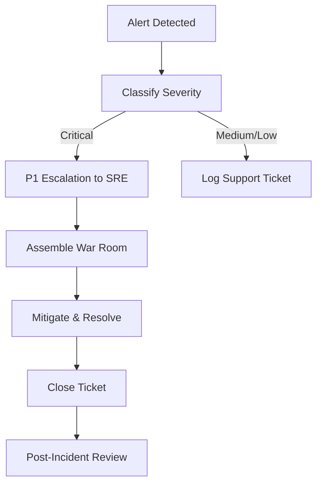

# AAR-OPS-001: Project AAROHAN Enterprise Operations Runbook

---

## 1. Cover Page

* **Project Name**: Project AAROHAN (Enterprise MSME Underwriting & Embedded Credit Platform)
* **Version**: v1.0.0
* **Runbook Version**: v1.0.0
* **Classification**: CONFIDENTIAL - BANK OPERATIONAL
* **Owner**: SRE and Platform Engineering Group
* **Approval Matrix**:
  - Head of IT Operations: APPROVED
  - Lead Site Reliability Engineer: APPROVED
  - Chief Information Security Officer (CISO): APPROVED

---

## 2. Purpose

This runbook defines the operational standards, daily tasks, system validations, and incident response matrices required to maintain the 24×7 availability, security, and reliability of Project AAROHAN.

---

## 3. Scope

This document covers all active runtime components of Project AAROHAN deployed on Google Cloud Platform, including container runtimes, managed databases, analytical repositories, vector indices, messaging queues, and artificial intelligence models.

---

## 4. Intended Audience

This runbook is designed for 24×7 Network Operations Center (NOC) teams, SRE leads, DevOps support teams, DBAs, and cloud platform engineers.

---

## 5. Platform Overview

Project AAROHAN processes critical loan and credit data for MSMEs. Operational targets focus on sub-second processing latencies, data privacy (data-at-rest encryption), and continuous auditing of algorithm-derived decisions.

---

## 6. Google Cloud Operational Architecture

* **Cloud Run**: Hosts the API Gateway and FastAPI microservices in autoscaling groups.
* **AlloyDB**: Centralized transactional database with synchronous replica nodes.
* **BigQuery**: Analyzes historical payroll, financial metrics, and early warning flags.
* **Cloud Storage**: Bucket repositories holding document PDFs, spreading histories, and signed consent artifacts.
* **Pub/Sub & Eventarc**: Publishes and routes internal system events (e.g., `consent.initiated`).
* **Vertex AI & Gemini**: Real-time evaluation of credit scorecards, financial health, and automated CAM compilations.
* **Secret Manager**: Secure environment configuration store.
* **Cloud Monitoring, Logging & Trace**: Aggregates latency profiles, trace spans, and alerting thresholds.

---

## 7. Production Operations Model

Support is structured across three tiers:
* **Tier 1 (NOC)**: 24×7 initial alert verification, triage, and basic script execution.
* **Tier 2 (SRE / Platform)**: System health validation, container restarts, scale-up adjustments, and networking debugs.
* **Tier 3 (Dev / Eng / DBA)**: Hotfix patches, database schema rollbacks, and code-level diagnostics.

---

## 8. Roles & Responsibilities

* **SRE Lead**: Manages SLO/SLI targets, coordinates post-incident reviews, and optimizes autoscaling metrics.
* **Database Administrator (DBA)**: Monitors AlloyDB disk capacity, transaction pools, and replica sync lag.
* **DevSecOps Engineer**: Validates secret rotations, audit logs, and IAM access mappings.

---

## 9. Operational Procedures

### Startup
* Verify GCP environment configurations and Secret Manager keys.
* Enable VPC Serverless connectors.
* Deploy containers to Cloud Run revisions.

### Shutdown
* Shift ingress traffic to static maintenance pages at the Load Balancer.
* Scale Cloud Run service instances to 0.

### Restart
* Trigger a safe restart of Cloud Run services via revision updates:
```bash
gcloud run services update-traffic ocen-uli-service --to-latest --region=asia-south1
```

### Scaling
* Scaling is automatically governed by CPU/memory usage profiles. High traffic limits can be updated manually:
```bash
gcloud run services update ocen-uli-service --max-instances=100 --region=asia-south1
```

### Maintenance
* Schedule maintenance windows on weekends between 02:00 and 04:00 IST.

---

## 10. Daily Operations Checklist

- [ ] Check SRE Alert Dashboards for unresolved warnings.
- [ ] Confirm AlloyDB replication lag is under 100ms.
- [ ] Verify daily database backup completion status.
- [ ] Check CPU/Memory utilization peaks.

---

## 11. Weekly Operations Checklist

- [ ] Audit Secret Manager logs for unauthorized reads.
- [ ] Review Cloud Run instance counts and billing dashboards.
- [ ] Run automated vulnerability scans.

---

## 12. Monthly Operations Checklist

- [ ] Execute dry-run database restore operations from backups.
- [ ] Rotate development and staging API keys.
- [ ] Review Capacity Planning logs.

---

## 13. Health Check Procedures

### Application
* Call `/healthz` on each active service. Expect `{"status": "healthy"}` and `200 OK`.

### Infrastructure
* Query GCP Cloud Run metrics for container instance limits.

### Database
* Check AlloyDB health status:
```bash
gcloud alloydb instances list --cluster=aarohan-cluster --region=asia-south1
```

### AI Services
* Run automated validation prompts against Vertex AI models.

### API Gateway
* Query HTTP response distributions (expecting 99.9% non-5xx responses).

---

## 14. Monitoring Dashboard Guide

The master dashboard in GCP Cloud Monitoring contains:
1. **API Latency Widget**: Tracks p95 and p99 response times.
2. **Database Load Widget**: Displays CPU load and connection pools for AlloyDB.
3. **Queue Health Widget**: Tracks Pub/Sub unacknowledged message queues.

---

## 15. Alert Matrix

| Severity | Metric | Condition | Action |
| :--- | :--- | :--- | :--- |
| **Critical** | `/healthz` down | Endpoint returns non-200 for 3 min | Page Tier 2 SRE & NOC Immediately |
| **High** | API Latency | p99 > 3000ms for 5 min | Trigger SRE Triage |
| **Medium** | AlloyDB Storage | Disk capacity > 80% | SRE to increase storage limits |
| **Low** | Log Warnings | Rate of `WARNING` logs increases 30% | File Ticket for DEV Team |

---

## 16. Incident Management Process



1. **Detection**: Monitoring alert triggers.
2. **Classification**: NOC team assigns severity level (P1 to P4).
3. **Escalation**: P1 incidents notify the on-call SRE and Platform Leads.
4. **Resolution**: System mitigation steps executed (e.g., rolling restart).
5. **Closure**: Validate that metrics return to normal ranges.
6. **Post-Incident Review**: Compile Root Cause Analysis (RCA) document within 48 hours.

---

## 17. Service Recovery Procedures

* **FastAPI Service Crash**: Trigger Cloud Run revision rollback.
* **AlloyDB Outage**: Automatically failover to primary replica in secondary Zone.

---

## 18. Backup & Restore Operations

### Backups
* Automatically triggered daily at 01:00 IST.

### Restore
1. Create a new AlloyDB cluster.
2. Point the restore CLI target to the backup snapshot ID:
```bash
gcloud alloydb backups restore --cluster=aarohan-restored --backup=aarohan-daily-snap --region=asia-south1
```

---

## 19. Database Maintenance

* Run vacuum operations during monthly maintenance windows.
* Keep max connections capped at 500 connections per primary node.

---

## 20. Cloud Run Operations

To monitor logs:
```bash
gcloud beta run services logs tail ocen-uli-service --region=asia-south1
```

---

## 21. BigQuery Operations

Monitor BigQuery active query slots and execution delays.

---

## 22. Vertex AI Operations

Log Vertex AI endpoint predictions, verifying prompt success rates and latency behaviors.

---

## 23. Secret Rotation Procedures

Rotate primary secrets (e.g., `JWT_SECRET_KEY`) every 90 days:
1. Create new secret version in Secret Manager.
2. Update Cloud Run references.
3. Perform rolling restart of services.

---

## 24. Certificate Renewal

Load balancer SSL certificates are automatically renewed using Google-managed certificates.

---

## 25. Log Management

Logs are retained in Google Cloud Logging for 30 days. Archive sinks route logs to Cold Storage buckets for 7 years to meet compliance standards.

---

## 26. Capacity Planning

Conduct load scaling reviews quarterly. Increase baseline AlloyDB instance sizes if CPU levels average > 50% over a 30-day window.

---

## 27. Performance Monitoring

Evaluate p99 response times and throughput metrics.

---

## 28. Cost Monitoring

Review billing dashboards weekly in GCP Billing Console. Set budget alerts at 80% and 100% of the monthly threshold.

---

## 29. Security Monitoring

Verify system access metrics with Cloud Audit Logs.

---

## 30. AI Operations

* **Prompt Monitoring**: Track prompt template drift in Gemini.
* **Model Health**: Log output formats to detect hallucinations.
* **Human-in-the-loop**: Verify that manual approvals are logged on-chain.
* **AI Audit Logs**: Retain LLM prompts and responses for audit trailing.

---

## 31. Business Continuity Operations

Keep local sandbox database backups accessible in secondary regions.

---

## 32. Disaster Recovery Operations

In case of regional outage:
1. Promote the failover database replica in the secondary GCP region.
2. Update DNS records to route traffic to the secondary load balancer.

---

## 33. Known Operational Risks

* **API Ingestion Rate Limits**: Dynamic spikes in GST/MCA registry search rates may trigger external API limits.

---

## 34. Standard Operating Procedures (SOP)

* **SOP-001**: Executing a Microservice Rollback.
* **SOP-002**: Database Recovery from Cold Backup.

---

## 35. Runbook Checklists

Verify operational tasks are completed using daily, weekly, and monthly checklists.

---

## 36. Contact Matrix

* **Platform Operations**: `ops-support@bank.aarohan.com`
* **On-Call SRE**: Pager Duty Channel #72-Aarohan
* **DBA Support**: `dbas@bank.aarohan.com`

---

## 37. Operational KPIs

* **Mean Time to Detect (MTTD)**: < 5 minutes
* **Mean Time to Resolve (MTTR)**: < 30 minutes
* **Database Replication Lag**: < 200ms

---

## 38. SLA / SLO Targets

* **System Availability SLA**: 99.9%
* **API Success Rate SLO**: 99.95%

---

## 39. Appendix

* Dashboard Configuration Templates.
* Alert Threshold JSON Schemas.
