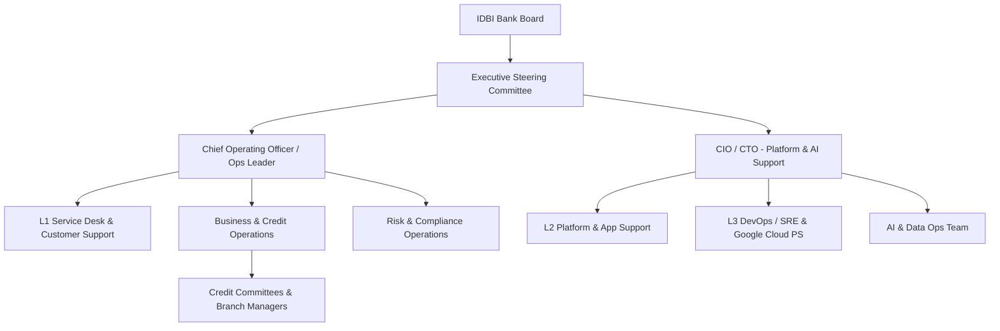

# Enterprise Operating Manual, Standard Operating Procedures (SOPs) & Knowledge Transfer Framework

**Document ID:** AAR-OPS-043  
**Document Name:** Enterprise Operating Manual, Standard Operating Procedures (SOPs) & Knowledge Transfer Framework  
**Version:** 1.0  
**Status:** Approved / Production-Ready  
**Dependencies:** AAR-EXE-042 (Executive Strategy & Architecture Blueprint)  
**Target Audience:** IDBI Bank Board, COO, CIO, CTO, Banking Operations, Credit & Risk Teams, Branch/Relationship Managers, Support Teams, and Google Cloud Professional Services  

---

## 1. Executive Summary & Operating Vision

### Executive Summary
Project AAROHAN represents IDBI Bank’s flagship AI-native MSME Credit underwriting, monitoring, and relationship management ecosystem. This operating manual establishes the definitive operational governance, standard operating procedures (SOPs), support matrices, and knowledge transfer frameworks required to run, monitor, and continuously optimize AAROHAN in a production environment. Leveraging Google Cloud’s state-of-the-art serverless architecture (Cloud Run, Vertex AI, Gemini, AlloyDB, Apigee, and ADK/MCP frameworks), this manual transitions the program from implementation into a highly resilient, compliant, and efficient daily operational run state.

### Enterprise Operating Vision
Our vision is to achieve a zero-latency, risk-aware, and highly automated MSME credit decisioning lifecycle. By blending AI-driven agentic workflows with human-in-the-loop (HITL) oversight, IDBI Bank will deliver credit approvals in hours rather than weeks, while maintaining institutional-grade compliance, auditability, and risk control.

### Operating Principles
1. **AI-First, Human-in-Loop (HITL):** Empower operational agents to handle heavy data aggregation and preliminary synthesis, while keeping credit decisions and risk overrides strictly under human accountability.
2. **Serverless & Resilient:** Operations rely on auto-scaling, self-healing cloud infrastructure (Cloud Run, AlloyDB, Vertex AI) monitored continuously for performance, drift, and security.
3. **Traceability & Auditability:** Every recommendation made by an AI agent must be logged with complete data lineage, grounding citations, and user-action records.
4. **Continuous Learning:** Feedback loops from credit committees, risk audits, and model drift metrics must continuously refine system prompts, tools, and vector bases.

---

## 2. Operations Organization & Governance

### Roles and Key Committees
*   **Operations Steering Committee (OSC):** Meets weekly to review SLA compliance, model drift, API latency issues, and critical credit bottlenecks.
*   **AI & Model Governance Board (AMGB):** Reviews Vertex AI Model performance, prompt safety filters, and ethical AI compliance monthly.
*   **Operational Risk Committee (ORC):** Audit and risk assessment body monitoring security compliance, access privileges, and regulatory deviations.

---

## 3. Operating Domains & Standard Operating Procedures (SOPs)

This section details the 30 operational domains defined for Project AAROHAN.

---

### OD-01: Executive Operations
*   **Purpose:** Enable senior leadership (COO, CIO, Board) to monitor portfolio performance, system efficiency, and overall credit health.
*   **Business Scope:** Executive dashboards, macro performance monitoring, escalation approvals, and strategic review.
*   **Roles:** COO, CIO, Chief Risk Officer (CRO).
*   **Responsibilities:** Review monthly performance indicators, authorize emergency system overrides, and sponsor continuous modernization initiatives.
*   **Inputs:** Monthly Operations Reports, Risk Dashboards, SLA Violation Logs.
*   **Outputs:** Strategic Directives, Platform Policy Updates, Governance Approvals.
*   **SOP:**
    1. On the 1st of every month, retrieve the consolidated Executive Operations Dashboard from **Looker**.
    2. Review MSME loan throughput, model approval-to-rejection ratios, and average decisioning cycle times.
    3. Identify any SLA deviations exceeding 5% and trigger corrective reviews with the L3 Platform Lead.
*   **Escalation Matrix:** L1 Support -> Biz Ops Manager -> COO/CIO.
*   **SLAs:** Strategic decision approvals within 24 hours of escalation.
*   **KPIs:** Average Decisioning Latency, Portfolio Delinquency Rate, Platform ROI.
*   **Business Risks:** Regulatory non-compliance, strategic misalignment, operational bottlenecks.
*   **Operational Controls:** Strict role-based access control (RBAC) on Looker dashboards; multi-signature approval for policy changes.
*   **Google Cloud Capability Mapping:** Looker, BigQuery.

---

### OD-02: Branch Operations
*   **Purpose:** Manage the local intake, document scanning, and basic customer validation at the physical branch level.
*   **Business Scope:** Local MSME customer registration, physical document collection, metadata entry.
*   **Roles:** Branch Operations Officers, Branch Managers.
*   **Responsibilities:** Authenticate physical customer presence, scan and upload primary documents, initiate digital onboarding.
*   **Inputs:** Physical KYC documents, signed loan applications.
*   **Outputs:** Digitized borrower profile, verified KYC metadata.
*   **SOP:**
    1. Scan borrower documents using the Branch Capture System.
    2. Upload metadata to the AAROHAN Document Pipeline via Apigee-protected endpoints.
    3. Verify automated OCR output; manually correct any missing fields.
*   **Escalation Matrix:** Branch Officer -> Branch Manager -> Regional Operations Lead.
*   **SLAs:** Document digitization and verification completed within 2 hours of customer visit.
*   **KPIs:** Document Scanning Accuracy, Onboarding Cycle Time.
*   **Business Risks:** Fraudulent KYC submissions, data entry errors.
*   **Operational Controls:** Mandatory dual-signature sign-off for document verification.
*   **Google Cloud Capability Mapping:** Apigee, Cloud Run, Cloud Logging.

---

### OD-03: Relationship Manager (RM) Operations
*   **Purpose:** Empower RMs to manage customer relationships, prepare credit pitches, and resolve processing blockers.
*   **Business Scope:** Pre-screening, relationship nurturing, information gathering, credit application submission.
*   **Roles:** Relationship Managers, Sales Team.
*   **Responsibilities:** Maintain customer interaction records, submit structured financial files, explain AI-generated terms to clients.
*   **Inputs:** Lead data, customer financial statement drafts, tax returns.
*   **Outputs:** Formal Loan Applications, Relationship Health Logs.
*   **SOP:**
    1. Initiate customer profile inside the RM portal.
    2. Utilize Gemini-powered assistants to extract financial trends from balance sheets.
    3. Finalize draft application and submit to the automated credit workflow.
*   **Escalation Matrix:** RM -> Regional Sales Manager -> Chief Credit Officer.
*   **SLAs:** Application pre-screen completed within 24 hours.
*   **KPIs:** Lead conversion rate, application completeness index.
*   **Business Risks:** Misrepresented customer data, high customer drop-out rate.
*   **Operational Controls:** Integration with external credit bureaus for validation; prompt audit trails.
*   **Google Cloud Capability Mapping:** Gemini, ADK, Vertex AI.

---

### OD-04: Credit Operations
*   **Purpose:** Perform detailed financial analysis, credit scoring, and draft decisioning reports.
*   **Business Scope:** Financial spreading, ratio analysis, risk rating calculation, draft credit memo generation.
*   **Roles:** Credit Analysts, Senior Credit Managers.
*   **Responsibilities:** Assess borrower debt service capacity, verify credit bureau reports, write final decision recommendations.
*   **Inputs:** Digital documents, automated model scoring feeds, bureau reports.
*   **Outputs:** Draft Credit Memorandum, Risk Rating Recommendations.
*   **SOP:**
    1. Review the AI-generated Credit Memo draft in the underwriting queue.
    2. Verify grounding citations for bank statement analyses.
    3. Approve or adjust the calculated credit score with written justification.
*   **Escalation Matrix:** Credit Analyst -> Senior Credit Manager -> Head of Underwriting.
*   **SLAs:** Credit Memo generation and review within 4 hours.
*   **KPIs:** Credit assessment accuracy, Underwriting turn-around-time (TAT).
*   **Business Risks:** Underestimation of risk, credit score inflation.
*   **Operational Controls:** Automated policy rules engine matching IDBI underwriting policies; model explainability hooks.
*   **Google Cloud Capability Mapping:** Vertex AI, Cloud Workflows, BigQuery.

---

### OD-05: Credit Committee Operations
*   **Purpose:** Review high-value MSME applications and grant final sanction approvals.
*   **Business Scope:** Multi-tiered credit committee meetings, sanction letter generation, exception approvals.
*   **Roles:** Committee Members, Credit Committee Chair.
*   **Responsibilities:** Evaluate credit proposals, debate exceptions, authorize loan disbursements.
*   **Inputs:** Final Credit Memo, Risk Reports, Compliance sign-offs.
*   **Outputs:** Sanction Letters, Rejection Records, Committee Minutes.
*   **SOP:**
    1. Retrieve the aggregated Committee Credit dossier via the secure portal.
    2. Review recommendations and security configurations.
    3. Cast digital votes; issue final sanction letters via automated workflow.
*   **Escalation Matrix:** Committee Secretary -> Committee Chair -> Board Credit Committee.
*   **SLAs:** Committee decision within 48 hours of dossier finalization.
*   **KPIs:** Approval rate, time-to-sanction, exception percentage.
*   **Business Risks:** Delay in sanction, regulatory deviations, bad loan approvals.
*   **Operational Controls:** Cryptographically secure voting, immutable audit log of approvals in AlloyDB.
*   **Google Cloud Capability Mapping:** AlloyDB, Apigee, Cloud Workflows.

---

### OD-06: Risk Operations
*   **Purpose:** Oversee portfolio credit risk, model parameters, and aggregate risk reporting.
*   **Business Scope:** Portfolio risk modeling, stress testing, default monitoring, limits management.
*   **Roles:** Risk Officers, Portfolio Risk Managers.
*   **Responsibilities:** Monitor Early Warning Signals (EWS), update risk thresholds, validate model updates.
*   **Inputs:** Real-time transaction feeds, external economic indices, delinquency trends.
*   **Outputs:** Monthly Risk Reports, Early Warning Signal Alerts, Limit Modifications.
*   **SOP:**
    1. Check the EWS console daily for flagging alerts on existing borrowers.
    2. Coordinate with RMs for high-risk accounts to initiate restructuring or recovery procedures.
    3. Run stress-testing jobs against BigQuery database models.
*   **Escalation Matrix:** Risk Officer -> Chief Risk Officer.
*   **SLAs:** EWS alert investigation within 24 hours of trigger.
*   **KPIs:** Non-Performing Asset (NPA) ratio, EWS false-positive rate.
*   **Business Risks:** Unexpected portfolio stress, lagging indicator tracking.
*   **Operational Controls:** Automated nightly risk-score recalculation; independent validation of model parameters.
*   **Google Cloud Capability Mapping:** BigQuery, Looker, AlloyDB.

---

### OD-07: Compliance Operations
*   **Purpose:** Ensure all credit activities and AI model recommendations adhere to RBI regulations and internal audit policies.
*   **Business Scope:** Regulatory compliance, data privacy protection (DPDP), fair-lending verification.
*   **Roles:** Compliance Officers, Legal Counsel.
*   **Responsibilities:** Audit AI decision paths for bias, file regulatory reports, verify KYC compliance.
*   **Inputs:** Auditable AI reasoning logs, transaction logs.
*   **Outputs:** Compliance Audit Reports, Regulatory Filings.
*   **SOP:**
    1. Run weekly random audits on credit recommendations generated by the Gemini engine.
    2. Ensure explaining attributes do not contain prohibited fields (e.g., gender, race, religion).
    3. Archive compliance validation certificates.
*   **Escalation Matrix:** Compliance Officer -> Head of Compliance -> Board.
*   **SLAs:** Periodic audit reports submitted within 5 days of month-end.
*   **KPIs:** Compliance Audit pass rate, Zero regulatory breach events.
*   **Business Risks:** Fines and penalties, reputational damage.
*   **Operational Controls:** Masking of PII (Personally Identifiable Information); immutable system audit logging.
*   **Google Cloud Capability Mapping:** Cloud Logging, BigQuery, Apigee.

---

### OD-08: AI Operations (AIOps)
*   **Purpose:** Monitor AI model performance, trace prompts, and handle model degradation/drift.
*   **Business Scope:** Vertex AI endpoint monitoring, prompt engineering updates, agent orchestration monitoring.
*   **Roles:** AI Engineers, MLOps Engineers.
*   **Responsibilities:** Track model latency, check drift metrics, run prompt validation tests, manage vector search indexes.
*   **Inputs:** Model telemetry data, prompt logs, feedback loops.
*   **Outputs:** Promoted prompts, Retrained model weights, Index updates.
*   **SOP:**
    1. Monitor Vertex AI Model Monitoring dashboards daily for performance drift.
    2. Check the safety filtering logs to identify blocked responses.
    3. Test prompt adjustments in the staging environment before production promotion.
*   **Escalation Matrix:** MLOps Engineer -> Lead Data Scientist -> Chief AI Architect.
*   **SLAs:** Critical model drift alerts resolved within 4 hours.
*   **KPIs:** Model Latency, Drift Index, Prompt Safety Rate.
*   **Business Risks:** Halucinations, discriminatory recommendations, model degradation.
*   **Operational Controls:** Automated testing suites for prompts; shadow deployment of models.
*   **Google Cloud Capability Mapping:** Vertex AI, Gemini, Cloud Monitoring.

---

### OD-09: Agent Operations
*   **Purpose:** Manage and orchestrate autonomous AI agents built using the Agent Development Kit (ADK) and Model Context Protocol (MCP).
*   **Business Scope:** Agent lifecycle management, tool authorization, workflow orchestration.
*   **Roles:** Agent Systems Administrators, DevOps Engineers.
*   **Responsibilities:** Track agent invocation statistics, manage API keys for MCP tools, audit agent-to-agent communication.
*   **Inputs:** ADK logs, tool call execution logs, resource usage metrics.
*   **Outputs:** Agent Configuration Manifests, Tool access permissions.
*   **SOP:**
    1. Review tool call error rates from the MCP logs weekly.
    2. Audit the system access bounds granted to agents in the configuration repository.
    3. Deploy patch configurations to ADK runtimes when upstream APIs change.
*   **Escalation Matrix:** Agent Admin -> Platform Lead -> CIO.
*   **SLAs:** Agent tool errors resolved within 2 hours.
*   **KPIs:** Agent Task Completion Rate, Tool Execution Latency.
*   **Business Risks:** Agent loop exceptions, unauthorized system access by agents.
*   **Operational Controls:** Least privilege access permissions for agent tools; maximum execution step limits (circuit breakers).
*   **Google Cloud Capability Mapping:** Cloud Run, ADK, MCP, Cloud Logging.

---

### OD-10: Data Operations (DataOps)
*   **Purpose:** Manage data ingestion pipelines, data quality checks, and database health.
*   **Business Scope:** ETL pipelines, AlloyDB replication, BigQuery warehouse maintenance.
*   **Roles:** Database Administrators (DBAs), Data Engineers.
*   **Responsibilities:** Monitor pipeline execution, optimize SQL queries, maintain data catalogs, enforce data lifecycle policies.
*   **Inputs:** Ingestion logs, database performance metrics, replication lag reports.
*   **Outputs:** Data Quality Dashboards, Clean Database Replicas.
*   **SOP:**
    1. Monitor the daily BigQuery data sync from core banking systems.
    2. Verify schema integrity and trigger repair pipelines for any schema-mismatch failures.
    3. Monitor AlloyDB transaction locks and vacuuming performance.
*   **Escalation Matrix:** Data Engineer -> Lead DBA -> Data Director.
*   **SLAs:** Data ingestion pipelines completed by 06:00 AM daily.
*   **KPIs:** Ingestion Success Rate, Replication Lag, Query Execution Time.
*   **Business Risks:** Stale customer data, data corruption, analytics downtime.
*   **Operational Controls:** Automated anomaly detection on ingestion volume; table-level encryption keys.
*   **Google Cloud Capability Mapping:** AlloyDB, BigQuery, Pub/Sub.

---

### OD-11: Knowledge Operations (KnOps)
*   **Purpose:** Maintain vector databases, prompt catalogs, and grounding documentation up to date.
*   **Business Scope:** Vector store index rebuilding, document embedding, prompt version control.
*   **Roles:** Knowledge Engineers, Document Librarians.
*   **Responsibilities:** Convert policies into text embeddings, update standard underwriting guidelines, purge outdated credit policies.
*   **Inputs:** Revised lending policies, vector storage utilization reports.
*   **Outputs:** Updated Vector Indexes, Grounding Metadata tables.
*   **SOP:**
    1. Upon receipt of a new policy circular, parse the text into structured blocks.
    2. Generate vector embeddings using Vertex AI Text Embedding models.
    3. Push updates to the AlloyDB Vector Store index and run similarity test queries.
*   **Escalation Matrix:** Knowledge Engineer -> Lead AI Engineer -> Head of Retail Credit.
*   **SLAs:** Lending policy updates pushed to vectors within 12 hours of official circular.
*   **KPIs:** Search Retrieval Recall (R@K), Embedding pipeline success rate.
*   **Business Risks:** Outdated underwriting policy application by AI agents.
*   **Operational Controls:** Versioned document archives; mandatory human validation of retrieval accuracy post-indexing.
*   **Google Cloud Capability Mapping:** AlloyDB (Vector Search), Vertex AI.

---

### OD-12: API Operations (APIOps)
*   **Purpose:** Manage Apigee API gateways, traffic routing, security, and usage metrics.
*   **Business Scope:** API gateway configurations, rate-limiting, authentication controls, developer portal.
*   **Roles:** API Platform Engineers, Security Admins.
*   **Responsibilities:** Monitor API latency, deploy API proxy updates, manage OAuth client secrets, investigate API errors.
*   **Inputs:** Apigee access logs, backend error metrics, client credential requests.
*   **Outputs:** API proxy deployments, API utilization statistics.
*   **SOP:**
    1. Monitor Apigee dashboards for spike arrests and routing errors.
    2. Enforce API security policies (IP whitelisting, payload encryption, OAuth validation).
    3. Perform quarterly reviews of API access tokens.
*   **Escalation Matrix:** API Engineer -> API Platform Lead -> CISO.
*   **SLAs:** API proxy updates deployed during maintenance window with zero downtime.
*   **KPIs:** API availability (99.99%), P99 API response time.
*   **Business Risks:** Data exposure, denial of service, integration breakages.
*   **Operational Controls:** WAF protection, automated threat detection rules, encrypted environment variables.
*   **Google Cloud Capability Mapping:** Apigee.

---

### OD-13: Event Operations
*   **Purpose:** Manage the asynchronous messaging infrastructure powering agent coordination and integration workflows.
*   **Business Scope:** Pub/Sub topics, Eventarc routing rules, queue backlogs.
*   **Roles:** Platform Engineers, Message Queue Administrators.
*   **Responsibilities:** Monitor dead-letter queues, adjust topic partitions, track message delivery latencies.
*   **Inputs:** Message metrics, system log pipelines.
*   **Outputs:** Topic configuration profiles, Queue alert remediations.
*   **SOP:**
    1. Monitor the Pub/Sub console for high unacknowledged message counts.
    2. Inspect dead-letter queues (DLQ) for failed credit event processing.
    3. Replay failed events once downstream dependencies are restored.
*   **Escalation Matrix:** SysAdmin -> Lead Middleware Architect -> Platform Lead.
*   **SLAs:** Dead-letter queue analysis initiated within 30 minutes of trigger.
*   **KPIs:** Queue lag duration, message processing success rate.
*   **Business Risks:** Dropped notifications, inconsistent workflow states across credit systems.
*   **Operational Controls:** Automatic exponential backoff; dual-region Pub/Sub message replication.
*   **Google Cloud Capability Mapping:** Pub/Sub, Eventarc.

---

### OD-14: Platform Operations
*   **Purpose:** Manage infrastructure provisioned on Google Cloud, resource scaling, and system performance.
*   **Business Scope:** Cloud Run configurations, network settings, VPC controls, system access.
*   **Roles:** DevOps Engineers, Cloud Infrastructure Architects.
*   **Responsibilities:** Provision infrastructure as code (IaC), monitor CPU/memory thresholds, optimize cloud spend.
*   **Inputs:** Cloud Monitoring alerts, billing reports, infrastructure manifests.
*   **Outputs:** Updated Terraform state files, resource allocation changes.
*   **SOP:**
    1. Monitor CPU/Memory utilization of Cloud Run services.
    2. Adjust minimum instance counts for peak operational banking hours (9:00 AM - 6:00 PM).
    3. Review cloud infrastructure security postures on Security Command Center.
*   **Escalation Matrix:** DevOps Engineer -> Infrastructure Manager -> CIO.
*   **SLAs:** Infrastructure provisioning within 24 hours of approval.
*   **KPIs:** Platform uptime (99.99%), Infrastructure Cost Efficiency.
*   **Business Risks:** Performance degradation under load, security vulnerabilities, budget overruns.
*   **Operational Controls:** CI/CD pipeline triggers; immutable infrastructure deployments.
*   **Google Cloud Capability Mapping:** Cloud Run, Cloud Monitoring, VPC.

---

### OD-15: Incident Management
*   **Purpose:** Restore normal service operations as quickly as possible and minimize adverse impact on banking operations.
*   **Business Scope:** Outage resolution, system degradation response, stakeholder communication.
*   **Roles:** Incident Managers, L1/L2/L3 Engineers.
*   **Responsibilities:** Classify incident severity, coordinate response bridges, log post-incident details.
*   **Inputs:** Automated alerts, service desk escalations, user bug reports.
*   **Outputs:** Incident resolution reports, communication updates.
*   **SOP:**
    1. Identify and categorize incident severity (P1 to P4).
    2. For P1 incidents, spin up the Incident War Room bridge and engage L3/SRE teams.
    3. Implement workaround or hotfix, run verification tests, and resolve incident.
*   **Escalation Matrix:** See Service Management - Incident Escalation section.
*   **SLAs:** P1 resolution < 2 hours; P2 < 4 hours; P3 < 24 hours.
*   **KPIs:** Mean Time to Resolve (MTTR), SLA compliance rate.
*   **Business Risks:** Lost revenue, RM downtime, customer dissatisfaction.
*   **Operational Controls:** Automated alerting configurations; standard incident template workflows.
*   **Google Cloud Capability Mapping:** Cloud Monitoring, Cloud Logging.

---

### OD-16: Problem Management
*   **Purpose:** Identify root causes of recurring incidents and prevent them from repeating.
*   **Business Scope:** Post-mortem analyses, root cause investigations, permanent workaround deployment.
*   **Roles:** Problem Managers, SREs.
*   **Responsibilities:** Conduct Root Cause Analysis (RCA), assign corrective action plans, document temporary workarounds.
*   **Inputs:** Incident logs, resolution reports, telemetry history.
*   **Outputs:** RCA Documents, Known Error Database (KEDB) updates.
*   **SOP:**
    1. Initiate problem ticket for any recurring incident (2+ identical issues within 30 days) or any P1 incident.
    2. Analyze log traces in Cloud Logging to trace backend errors.
    3. Formulate permanent code/infra modifications and queue in the release backlog.
*   **Escalation Matrix:** Problem Coordinator -> Problem Management Chair -> CIO.
*   **SLAs:** RCA published within 5 business days of incident closure.
*   **KPIs:** Recurring Incident Count, Backlog of open problem records.
*   **Business Risks:** Ongoing platform instability, unresolved structural defects.
*   **Operational Controls:** Documented RCA templates; sign-off requirements for closing problem records.
*   **Google Cloud Capability Mapping:** Cloud Logging, Cloud Monitoring.

---

### OD-17: Change Enablement
*   **Purpose:** Control the lifecycle of all changes to minimize risk and impact on live banking operations.
*   **Business Scope:** Production code deployments, database schema alterations, configuration tweaks.
*   **Roles:** Change Advisory Board (CAB), Release Managers.
*   **Responsibilities:** Evaluate change risks, schedule deployment windows, authorize emergency updates.
*   **Inputs:** Change Requests (CR), risk evaluations, rollback strategies.
*   **Outputs:** Approved Change Calendar, CAB meeting minutes.
*   **SOP:**
    1. Submit Change Request in tool showing risk category, testing outcomes, and fallback plan.
    2. Present plan at weekly CAB meetings for non-standard modifications.
    3. Execute deployments during scheduled low-traffic hours (typically 11:00 PM - 3:00 AM).
*   **Escalation Matrix:** Release Coordinator -> Release Manager -> CTO.
*   **SLAs:** Standard changes approved within 3 days; emergency changes in 1 hour.
*   **KPIs:** Change success rate, percentage of emergency changes.
*   **Business Risks:** Deployment failures causing outages, incompatible software releases.
*   **Operational Controls:** Segregation of duties (creators cannot approve); automated rollback pipelines.
*   **Google Cloud Capability Mapping:** Cloud Build, Cloud Workflows.

---

### OD-18: Release Operations
*   **Purpose:** Manage the building, testing, and deployment of software artifacts to the environment.
*   **Business Scope:** Artifact creation, configuration compilation, multi-environment deployments.
*   **Roles:** Release Engineers, DevSecOps.
*   **Responsibilities:** Manage CI/CD pipelines, tag releases, execute rollbacks.
*   **Inputs:** Tested repository branches, configuration properties.
*   **Outputs:** Live system builds, release logs.
*   **SOP:**
    1. Trigger Cloud Build compilation for the approved version tag.
    2. Execute automated vulnerability scans on the container images.
    3. Deploy to Cloud Run using canary routing starting at 10% traffic.
*   **Escalation Matrix:** Release Engineer -> Lead SRE -> CTO.
*   **SLAs:** Regular software release cycle completed bi-weekly.
*   **KPIs:** Deployment cycle time, pipeline failures.
*   **Business Risks:** Inclusion of security flaws, system mismatch errors.
*   **Operational Controls:** Cryptographic signing of container images; automated unit test coverage requirements (>85%).
*   **Google Cloud Capability Mapping:** Cloud Run, Cloud Logging.

---

### OD-19: Production Support
*   **Purpose:** Maintain overall application health and resolve minor operational system queries.
*   **Business Scope:** System health monitoring, background job checking, data patching operations.
*   **Roles:** L2 Support Engineers.
*   **Responsibilities:** Monitor health check logs, handle non-incident service inquiries, perform basic configuration changes.
*   **Inputs:** Telemetry dashboards, support tickets.
*   **Outputs:** Updated configurations, query resolutions.
*   **SOP:**
    1. Review system resource dashboards every 2 hours.
    2. Address L1 escalations regarding payment integration queues.
    3. Execute predefined operational script files for system maintenance.
*   **Escalation Matrix:** L2 Support Engineer -> L3 Support / DevOps -> Tech Lead.
*   **SLAs:** First response to tickets within 30 minutes.
*   **KPIs:** Ticket first-contact-resolution rate, backlog age.
*   **Business Risks:** Delayed customer support, undetected slow system failures.
*   **Operational Controls:** Mandatory audit logging of L2 support administrative actions.
*   **Google Cloud Capability Mapping:** Cloud Monitoring, Cloud Logging.

---

### OD-20: Service Desk
*   **Purpose:** Act as the single point of contact (SPOC) for internal bank staff using the AAROHAN platform.
*   **Business Scope:** Internal user ticket intake, triage, password resets, basic platform usage assistance.
*   **Roles:** Service Desk Agents, Desk Leads.
*   **Responsibilities:** Register user tickets, perform primary triage, dispatch assignments to specialized teams.
*   **Inputs:** Phone calls, emails, internally submitted ticketing forms.
*   **Outputs:** Categorized tickets, user guidance responses.
*   **SOP:**
    1. Record every support request in the ticketing system.
    2. Match queries against the internal troubleshooting knowledge base.
    3. Dispatch unresolved tickets to L2 Application/Platform support teams.
*   **Escalation Matrix:** Service Desk Agent -> Service Desk Lead -> Service Manager.
*   **SLAs:** Call answer time < 30 seconds; Ticket triage < 15 minutes.
*   **KPIs:** Abandonment rate, user satisfaction score (CSAT).
*   **Business Risks:** Operational friction for bank staff, poor routing of complex issues.
*   **Operational Controls:** Call recording and ticket audits.
*   **Google Cloud Capability Mapping:** Service Desk Ticketing Integrations.

---

### OD-21: Customer Support
*   **Purpose:** Address external borrower queries related to application status, portal issues, and loan accounts.
*   **Business Scope:** Borrower communication, application status updates, external portal troubleshooting.
*   **Roles:** Customer Support Agents.
*   **Responsibilities:** Guide borrowers through portal registration, provide application status details, document borrower complaints.
*   **Inputs:** Borrower chat messages, customer support emails, helpline calls.
*   **Outputs:** Customer ticket cases, interaction records.
*   **SOP:**
    1. Authenticate the caller or chat user using bank procedures.
    2. Check the borrower status dashboard in AAROHAN.
    3. Provide accurate updates or escalate complex profile errors to L2 support.
*   **Escalation Matrix:** Customer Agent -> Support Supervisor -> Grievance Officer.
*   **SLAs:** Email responses within 4 hours; Call hold time < 2 minutes.
*   **KPIs:** First contact resolution (FCR), Customer satisfaction index.
*   **Business Risks:** Poor brand reputation, customer drop-outs, complaints.
*   **Operational Controls:** Strict authentication procedures to protect customer banking data.
*   **Google Cloud Capability Mapping:** Vertex AI (for chat assistance), Apigee.

---

### OD-22: Business Continuity Operations
*   **Purpose:** Maintain essential credit decisioning operations during system outages or local disasters.
*   **Business Scope:** Offline contingency procedures, alternative credit analysis processing.
*   **Roles:** Business Continuity Coordinator, Business Continuity Managers.
*   **Responsibilities:** Declare disaster states, trigger alternative working procedures, manage personnel safety.
*   **Inputs:** Localized office outage alerts, system accessibility audits.
*   **Outputs:** Business Continuity declarations, operational status updates.
*   **SOP:**
    1. Trigger offline processing protocols if the core AAROHAN web portals are down for more than 4 consecutive hours.
    2. Direct branches to gather application files locally using offline spreadsheet templates.
    3. Prepare physical documents for queuing until operations resume.
*   **Escalation Matrix:** BC Manager -> Chief Operating Officer.
*   **SLAs:** Business Continuity Plan (BCP) activation within 1 hour of declaration.
*   **KPIs:** Continuity Readiness Index, mock drill frequency.
*   **Business Risks:** Severe business processing delays, reputational exposure.
*   **Operational Controls:** Quarterly business continuity test exercises and validation drills.
*   **Google Cloud Capability Mapping:** Cloud Workflows, AlloyDB (for replication).

---

### OD-23: Disaster Recovery (DR) Operations
*   **Purpose:** Recover technical systems and data platforms following a catastrophic platform failure.
*   **Business Scope:** Database failover execution, network routing switch, system restoration verification.
*   **Roles:** Disaster Recovery Lead, Infrastructure Engineers.
*   **Responsibilities:** Execute database cluster failovers, reconfigure DNS routing, verify application sanity post-restore.
*   **Inputs:** Platform outage declarations, DR failover scripts.
*   **Outputs:** Restored active primary platform, failover execution reports.
*   **SOP:**
    1. Initiate DR procedures once the primary cloud region is declared unreachable by Google Cloud status feeds.
    2. Execute AlloyDB cluster promotion in the secondary recovery region.
    3. Update Apigee routing proxies to point to the secondary Cloud Run instances.
*   **Escalation Matrix:** DR Engineer -> DR Lead -> Chief Information Officer.
*   **SLAs:** Recovery Time Objective (RTO) < 2 hours; Recovery Point Objective (RPO) < 15 minutes.
*   **KPIs:** DR execution duration, data discrepancy metrics.
*   **Business Risks:** Total system loss, permanent data corruption.
*   **Operational Controls:** Automated database replication; annual full-system failover tests.
*   **Google Cloud Capability Mapping:** AlloyDB (Cross-region replication), Apigee, Cloud Run.

---

### OD-24: Audit Support
*   **Purpose:** Provide evidence and system operational records for internal and external auditors.
*   **Business Scope:** Audit logging, credit decision trail generation, access review packaging.
*   **Roles:** Audit Support Coordinators, Security Analysts.
*   **Responsibilities:** Extract system configuration histories, compile credit evaluation trails, package compliance metrics.
*   **Inputs:** Audit query sheets, data request dates.
*   **Outputs:** Audit evidence packages, log exports.
*   **SOP:**
    1. Upon audit request, extract decision logging trails for target accounts from BigQuery.
    2. Package system access change histories from Cloud Logging audit data.
    3. Deliver encrypted evidence packages through the secure sharing portal.
*   **Escalation Matrix:** Audit Lead -> Compliance Officer -> Chief Risk Officer.
*   **SLAs:** Audit request fulfillments within 3 business days.
*   **KPIs:** Audit observation count, evidence compliance rate.
*   **Business Risks:** Regulatory audit findings, negative qualifications.
*   **Operational Controls:** Immutable write-once-read-many (WORM) storage configurations for audit logs.
*   **Google Cloud Capability Mapping:** Cloud Logging, BigQuery.

---

### OD-25: Regulatory Reporting Support
*   **Purpose:** Compile and submit mandatory regulatory filings to banking supervisors (e.g., RBI).
*   **Business Scope:** Regulatory reports (priority sector lending status, default classifications).
*   **Roles:** Regulatory Reporting Specialists.
*   **Responsibilities:** Build report templates, run daily extraction runs, submit certified reports.
*   **Inputs:** Operational databases, credit ledger data.
*   **Outputs:** Formatted regulatory reports, filing confirmations.
*   **SOP:**
    1. Execute monthly regulatory extraction workflows on BigQuery.
    2. Perform sanity checks against current core accounting balances.
    3. Generate the required RBI MSME reporting outputs and submit.
*   **Escalation Matrix:** Specialist -> Chief Financial Officer.
*   **SLAs:** Regulatory reports submitted 2 days ahead of official deadlines.
*   **KPIs:** Report accuracy rate, filing timeline compliance.
*   **Business Risks:** Late filing penalties, systemic classification errors.
*   **Operational Controls:** Automated schema validation of reporting files before submission.
*   **Google Cloud Capability Mapping:** BigQuery, Looker.

---

### OD-26: Executive Reporting
*   **Purpose:** Provide regular strategic operational intelligence to executive leadership.
*   **Business Scope:** Performance metrics synthesis, credit volume reporting, platform uptime overview.
*   **Roles:** Executive Reporting Analysts.
*   **Responsibilities:** Synthesize daily, weekly, and monthly dashboard highlights; summarize system costs.
*   **Inputs:** BigQuery reporting views, platform telemetry summaries.
*   **Outputs:** Executive briefings, operational slide packages.
*   **SOP:**
    1. Aggregate system and business KPIs using Looker templates.
    2. Draft qualitative executive summaries highlighting key accomplishments and performance warnings.
    3. Distribute reports to members of the Executive Operations Committee.
*   **Escalation Matrix:** Reporting Analyst -> Operations Manager -> COO.
*   **SLAs:** Monthly briefings delivered by the 5th business day of each month.
*   **KPIs:** Executive report delivery punctuality, dashboard usage.
*   **Business Risks:** Lagging strategic steering due to delayed operational data.
*   **Operational Controls:** Automated dashboard scheduling and credential management.
*   **Google Cloud Capability Mapping:** Looker, BigQuery.

---

### OD-27: Knowledge Transfer (KT) Operations
*   **Purpose:** Manage the continuous sharing and transfer of system knowledge to new staff.
*   **Business Scope:** Training documentation updates, technical walkthrough creation, KT session tracking.
*   **Roles:** Technical Trainers, Lead Developers.
*   **Responsibilities:** Update operating manuals, run walkthrough sessions, maintain code documentation.
*   **Inputs:** Code repository changes, operational changes.
*   **Outputs:** Updated KT modules, recorded sessions.
*   **SOP:**
    1. Review the change register for major platform updates monthly.
    2. Update internal wiki pages and documentation to reflect modifications.
    3. Schedule developer walkthroughs for any architectural modifications.
*   **Escalation Matrix:** KT Coordinator -> Training Director.
*   **SLAs:** KT materials updated within 14 days of a major production release.
*   **KPIs:** Training pass rates, onboarding duration for new engineers.
*   **Business Risks:** Key-man dependency risks, operational errors due to untrained team members.
*   **Operational Controls:** Mandatory KT sign-offs for all team transitions.
*   **Google Cloud Capability Mapping:** Document repositories.

---

### OD-28: Training Operations
*   **Purpose:** Manage ongoing training schedules, certifications, and system access tests for system operators.
*   **Business Scope:** Credit officer training, branch onboarding programs, system mock testing.
*   **Roles:** Training Administrators.
*   **Responsibilities:** Manage the training sandbox environment, schedule modules, track completion certifications.
*   **Inputs:** Onboarding rosters, training enrollment counts.
*   **Outputs:** Certified operator registers, training sandbox resets.
*   **SOP:**
    1. Enroll newly onboarded branch and credit staff into the AAROHAN Training path.
    2. Monitor completion of self-paced courses.
    3. Provision temporary credentials in the training sandbox environment.
*   **Escalation Matrix:** Training Admin -> Head of Human Resources.
*   **SLAs:** Sandbox environments refreshed and initialized weekly.
*   **KPIs:** Course completion rate, post-training sandbox evaluation scores.
*   **Business Risks:** Operating errors on live platform by untrained personnel.
*   **Operational Controls:** Automated verification of certification before granting production access.
*   **Google Cloud Capability Mapping:** Cloud Run (Sandbox environments).

---

### OD-29: Vendor Operations
*   **Purpose:** Coordinate with third-party service providers (credit bureaus, document verification, hosting).
*   **Business Scope:** SLA tracking, API integrations, vendor billing, issue escalation.
*   **Roles:** Vendor Relationship Managers, Procurement Analysts.
*   **Responsibilities:** Monitor external service response metrics, address billing disputes, coordinate vendor releases.
*   **Inputs:** External API uptime reports, invoices.
*   **Outputs:** Vendor performance reviews, payment authorizations.
*   **SOP:**
    1. Monitor third-party credit bureau API response times daily via Apigee dashboard metrics.
    2. Escalate any response timeouts exceeding 5 seconds to vendor contact points.
    3. Conduct monthly service reviews based on contract SLAs.
*   **Escalation Matrix:** Analyst -> Procurement Lead -> Chief Operating Officer.
*   **SLAs:** Vendor performance reviews completed monthly.
*   **KPIs:** Vendor API availability, time-to-escalation resolution.
*   **Business Risks:** Integration outages stopping credit scoring pipelines.
*   **Operational Controls:** Redundant vendor integrations; circuit breaker configurations in Apigee.
*   **Google Cloud Capability Mapping:** Apigee, Cloud Monitoring.

---

### OD-30: Continuous Operational Improvement (CI)
*   **Purpose:** Systematically improve operational workflows, automate manuals, and reduce system toil.
*   **Business Scope:** Process automation, system telemetry improvements, feedback loop analysis.
*   **Roles:** SREs, Process Architects.
*   **Responsibilities:** Identify operational bottlenecks, implement automations, perform periodic reviews of procedures.
*   **Inputs:** Incident ticket post-mortems, feedback surveys, system performance metrics.
*   **Outputs:** Automation scripts, process updates.
*   **SOP:**
    1. Collect and review operational toil metrics monthly.
    2. Select three low-value processes for replacement with automated workflows.
    3. Update the Enterprise Operating Manual repository with updated procedures.
*   **Escalation Matrix:** Process Architect -> Head of Continuous Improvement -> COO.
*   **SLAs:** Improvement initiatives selected and tracked quarterly.
*   **KPIs:** Automated toil reduction hours, process execution duration improvements.
*   **Business Risks:** Process stagnation, operational cost inflation.
*   **Operational Controls:** CAB review of all process automation implementations.
*   **Google Cloud Capability Mapping:** Cloud Workflows, BigQuery.

---

## 8. Document Approval & Change History

*   **Approved By:** 
    *   *Chief Operating Officer (IDBI Bank)*
    *   *Chief Information Officer (IDBI Bank)*
    *   *Lead Professional Services Consultant (Google Cloud)*
*   **Approval Date:** July 7, 2026

| Version | Date | Author | Description of Change | Approved By |
| :--- | :--- | :--- | :--- | :--- |
| **1.0** | 2026-07-07 | Lead Support Architect | Initial production-ready release under Project AAROHAN. | COO, CIO |
