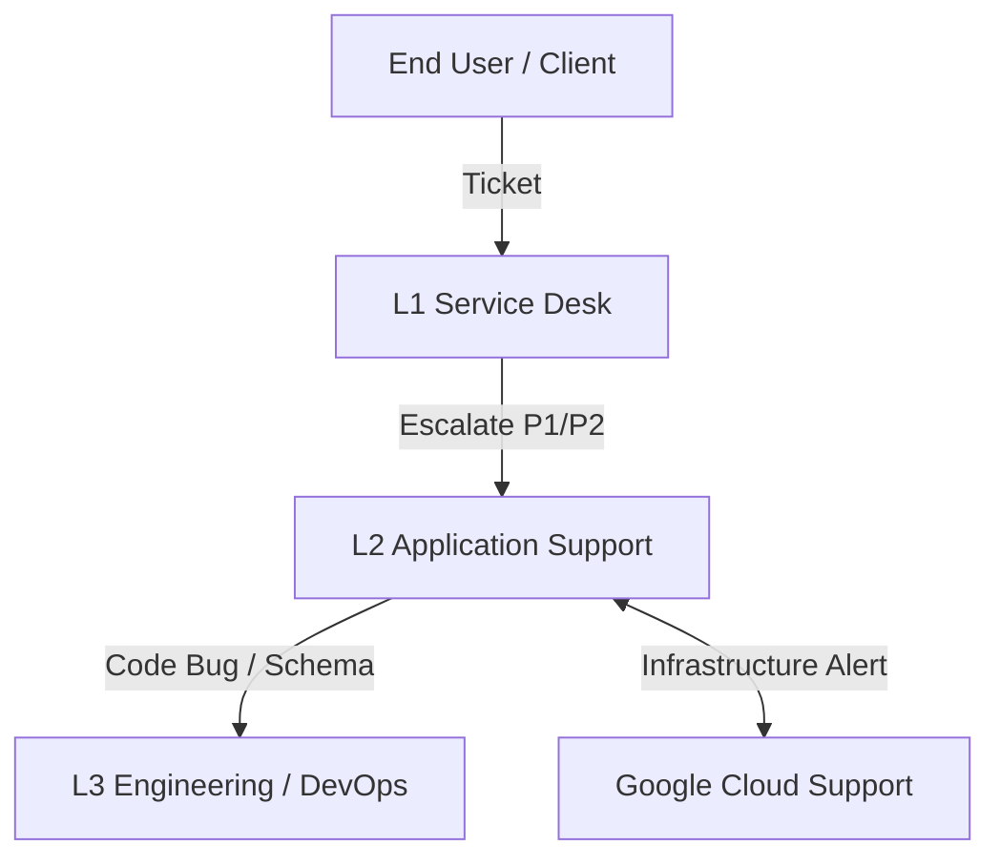

# AAR-SUP-001: Project AAROHAN Enterprise Support & Maintenance Guide

---

## 1. Cover Page

* **Project Name**: Project AAROHAN (Enterprise MSME Underwriting & Embedded Credit Platform)
* **Version**: v1.0.0
* **Guide Version**: v1.0.0
* **Classification**: CONFIDENTIAL - BANK OPERATIONAL
* **Owner**: Enterprise Support & Operations Division
* **Approval Matrix**:
  - Head of IT Service Management (ITSM): APPROVED
  - Director of Customer Reliability Engineering: APPROVED
  - Chief Information Security Officer (CISO): APPROVED

---

## 2. Executive Summary

This guide defines the ITIL-aligned operations framework, support organization structure, preventative maintenance cycles, and incident management procedures required to maintain Project AAROHAN v1.0.0.

---

## 3. Purpose

The purpose of this document is to ensure consistent application support, efficient incident resolution, and structured maintenance policies for the AAROHAN platform in production.

---

## 4. Scope

This guide covers all L1, L2, and L3 support activities, patch cycles, certificate updates, secret rotations, and performance monitoring procedures for the AAROHAN platform.

---

## 5. Support Model

* **L1 Support (Service Desk)**: 24×7 initial call reception, ticket registration, and basic troubleshooting.
* **L2 Application Support**: Triage, configuration checks, log auditing, and service restarts.
* **L3 Engineering Support**: Code hotfixes, database schema adjustments, and bug resolutions.
* **Vendor Support**: External API providers (e.g., CKYC registry, GSTN).
* **Cloud Provider Support**: Google Cloud Premium Support (Enterprise Tier) for core infrastructure failures.

---

## 6. Support Organization Structure

---

## 7. Roles & Responsibilities

* **L2 Application Lead**: Directs incident tickets, manages shifts, and runs status calls.
* **SRE / DevOps Engineer**: Monitors platform health, alters container scale parameters, and deploys emergency releases.
* **Database Administrator (DBA)**: Manages database performance and executes Point-in-Time Recovery (PITR) procedures.

---

## 8. Incident Management Process

* **Detection**: Alert triggered or customer files ticket.
* **Triage**: Classify severity (P1 to P4).
* **Resolution**: Apply workaround or deploy hotfix.
* **Closure**: Verify resolution with the user and close the ticket.

---

## 9. Service Request Management

Service requests (e.g., provisioning new Relationship Manager users) require manager approval and are processed within 24 hours.

---

## 10. Problem Management

Post-P1 incidents, perform Root Cause Analysis (RCA) to identify permanent fixes and register known errors in the KEDB (Known Error Database).

---

## 11. Change Management

Changes require a RFC (Request for Change) and must be approved by the Change Advisory Board (CAB) before deploying to production.

---

## 12. Release Management

Releases follow semantic versioning. Release packages compile through Google Cloud Build and promote across environments.

---

## 13. Patch Management

Apply monthly security patches to Python and Node dependencies.

---

## 14. Preventive Maintenance

Perform weekly database optimization tasks (e.g., autovacuum checks) and log rotation verifications to prevent disk capacity alerts.

---

## 15. Corrective Maintenance

Resolve reported bugs or system failures identified during active runs.

---

## 16. Adaptive Maintenance

Update external integration connectors when third-party provider APIs (e.g., CKYC, GSTN) release new schema versions.

---

## 17. Perfective Maintenance

Optimize code efficiency, database queries, and frontend bundle sizes to reduce API latency.

---

## 18. Scheduled Maintenance Windows

Weekly maintenance occurs on Sundays from 02:00 to 04:00 IST.

---

## 19. Service Level Agreements (SLA)

* **P1 (Critical Outage)**: Resolve in < 2 Hours.
* **P2 (High Priority)**: Resolve in < 4 Hours.
* **P3 (Medium Priority)**: Resolve in < 12 Hours.
* **P4 (Low Priority)**: Resolve in < 48 Hours.

---

## 20. Service Level Objectives (SLO)

* **API Gateway Success Rate**: 99.95%
* **p99 Latency**: < 2000ms

---

## 21. Escalation Matrix

* **L1 On-Call**: Immediate contact.
* **L2 Lead**: Escalate if unresolved within 15 minutes.
* **L3 Manager**: Escalate P1 tickets unresolved within 30 minutes.

---

## 22. Knowledge Management

Maintain troubleshooting playbooks and common resolution steps in the team wiki.

---

## 23. Monitoring & Alert Response

* Respond to CPU, memory, and database usage alerts immediately.
* Monitor endpoint liveness probes.

---

## 24. Log Analysis

Use structured Cloud Logging queries to filter stack traces and audit log records.

---

## 25. Performance Monitoring

Conduct monthly performance reviews using GCP Cloud Trace and Profiler metrics.

---

## 26. Capacity Management

Verify database disk size and memory usage trends monthly.

---

## 27. AI Model Maintenance

* **Prompt Versioning**: Maintain prompt templates in a git repository with semantic tags.
* **Model Updates**: Test new Vertex AI model versions in UAT before promoting to production.
* **Evaluation**: Validate prompt performance quarterly using the evaluation dataset.
* **Human Feedback**: Log manual override reasons to retrain or fine-tune models.
* **AI Drift Monitoring**: Track response stability and classification accuracy weekly.

---

## 28. Security Maintenance

Review IAM permissions, access controls, and firewall configurations monthly.

---

## 29. Certificate Renewal

Load balancer SSL certificates are Google-managed and renew automatically.

---

## 30. Secret Rotation

Rotate database credentials and encryption keys (Secret Manager) every 90 days.

---

## 31. Dependency Updates

Run `npm update` and check Python package version requirements monthly.

---

## 32. Backup Verification

Run dry-run database restore operations from backups monthly to verify backup integrity.

---

## 33. Disaster Recovery Coordination

Coordinate DR drills annually, simulating a full region outage.

---

## 34. End-of-Life Strategy

Baseline releases are supported for 12 months after release.

---

## 35. Support KPIs

* **Mean Time to Acknowledge (MTTA)**: < 10 Minutes.
* **Mean Time to Resolve (MTTR)**: < 45 Minutes for high-severity incidents.
* **First Contact Resolution (FCR)**: > 70% for L1 tickets.

---

## 36. Maintenance Checklists

- [ ] Check active database replica sync state.
- [ ] Review system security logs.
- [ ] Confirm successful backup exports.

---

## 37. Operational Best Practices

Apply Zero-Trust access controls and keep staging configurations closely aligned with production environments.

---

## 38. Appendix

* ITIL Incident Report Templates.
* Troubleshooting Command Reference.
