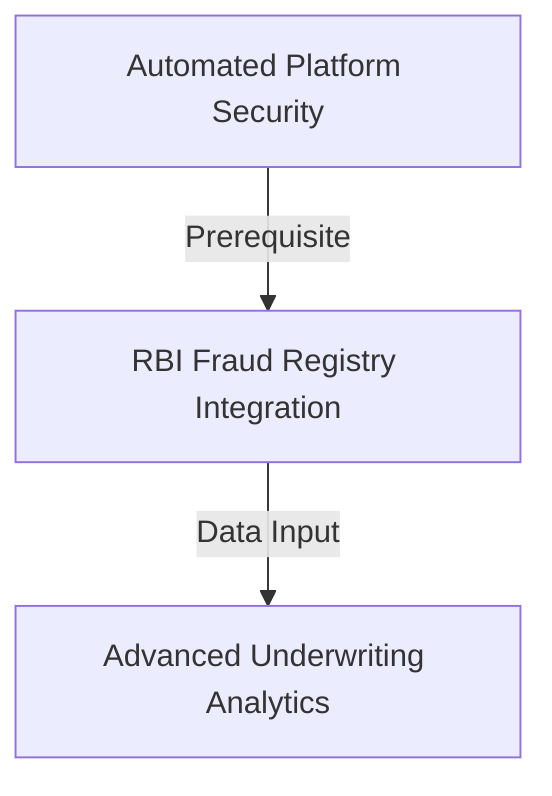

# AAR-V11-EPICS-001: Project AAROHAN Version 1.1 Enterprise Epic Catalog

---

## 1. Executive Summary

This document specifies the Version 1.1 Enterprise Epic Catalog for Project AAROHAN. It maps strategic business epics to facilitate traceability, release planning, and system modernization.

---

## 2. Product Vision Alignment

The Version 1.1 roadmap expands the lending platform to support larger scales, native mobile applications, active-active multi-region databases, and advanced AI-driven decisioning.

---

## 3. Epic Management Approach

Epics are high-level business goals decomposed into individual features and user stories. The Scrum Product Owner and Enterprise Architects govern epic lifecycles from backlog grooming to production deployment.

---

## 4. Prioritization Methodology

Prioritization is calculated using the WSJF (Weighted Shortest Job First) framework, scoring items based on business value, time criticality, risk reduction, and developer effort.

---

## 5. Enterprise Epic Catalog

### Epic ID: EP-11-001
* **Epic Name**: Automated Platform Security (Auto Secret Rotation)
* **Business Objective**: Implement secure, zero-human-involvement secret rotation schedules.
* **Business Value**: Protects the database and prevents API key exposure.
* **Description**: Configure a Cloud Scheduler task to rotate database credentials and sign keys every 90 days.
* **Success Criteria**: Automatic rotation completes without application downtime.
* **Dependencies**: Secret Manager APIs.
* **Risks**: Connectivity lag during container rolling restarts.
* **Priority**: Critical (Must Have)
* **Estimated Release**: Version 1.1.0
* **Related Backlog Items**: F-11-001
* **Acceptance Criteria**: Verification scripts confirm key rotation.

### Epic ID: EP-11-002
* **Epic Name**: Core Registry Integration (RBI Fraud Registry)
* **Business Objective**: Sync underwriting evaluations with public fraud check databases.
* **Business Value**: Protects the bank from loan defaults.
* **Description**: Connect the decision engine directly to the RBI Central Fraud Registry.
* **Success Criteria**: Blacklisted PAN lookups trigger automatic rejection.
* **Dependencies**: RBI Registry API.
* **Risks**: Network latency on external registry calls.
* **Priority**: High (Must Have)
* **Estimated Release**: Version 1.1.1
* **Related Backlog Items**: F-11-002
* **Acceptance Criteria**: Underwriting reports display RBI check status.

---

## 6. Epic Dependency Map

---

## 7. Proposed Release Plan

* **Version 1.1.0 (Q1)**: Focuses on EP-11-001 (Automated Platform Security) and base technical debt.
* **Version 1.1.1 (Q2)**: Focuses on EP-11-002 (RBI Registry Integration).
* **Version 1.2.0 (Q3)**: Focuses on launching the RM Mobile Application.

---

## 8. Enterprise KPI Alignment

* **Processing Speed**: Streamlines API calls to maintain sub-second runtimes.
* **Portfolio Health**: Integrates fraud registers to lower NPAs below 0.5%.

---

## 9. AI Capability Roadmap Alignment

Integrates Vertex AI model monitoring to verify prompt performance and safety filters.

---

## 10. Google Cloud Platform Alignment

Leverages Cloud KMS, Secret Manager, Cloud Scheduler, and Cloud Run to maintain serverless infrastructure.

---

## 11. Risk Assessment

* **Downstream API Failures**: External API changes are mitigated by using fallback mock sandboxes during network degradation.

---

## 12. Governance & Approval

Epic modifications require approval from the CPO and CTO.

---

## 13. Appendix

* WSJF calculation worksheets.
* Epic-to-Story mapping tables.
