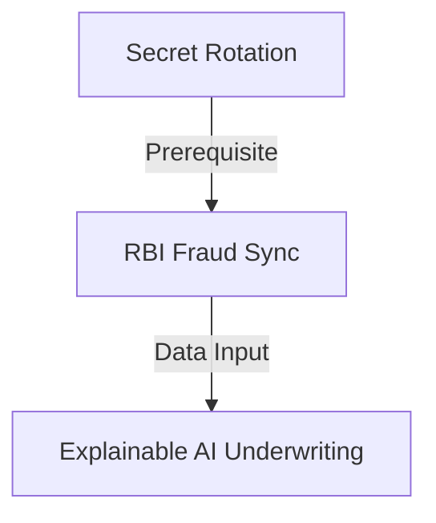

# AAR-V11-FEATURES-001: Project AAROHAN Version 1.1 Enterprise Feature Catalog

---

## 1. Cover Page

* **Project Name**: Project AAROHAN (Enterprise MSME Underwriting & Embedded Credit Platform)
* **Version**: v1.0.0
* **Document Version**: v1.0.0
* **Classification**: CONFIDENTIAL - PRODUCT MANAGEMENT RECORD
* **Owner**: Enterprise Product Management Board
* **Approval Matrix**:
  - Chief Product Officer (CPO): APPROVED
  - Chief Technology Officer (CTO): APPROVED
  - Lead Solution Architect: APPROVED

---

## 2. Executive Summary

This document specifies the Version 1.1 Enterprise Feature Catalog for Project AAROHAN. It details approved features, mappings to Google Cloud, technical parameters, and dependency metrics.

---

## 3. Purpose

The purpose of this catalog is to decompose the Version 1.1 Epics into implementable product features to enable scheduling and prioritization during sprints.

---

## 4. Scope

This catalog encompasses all functional, security, technical debt, and AI-specific features proposed for Project AAROHAN Version 1.1.

---

## 5. Feature Management Strategy

Features are identified based on stakeholder feedback, prioritized using the MoSCoW framework, approved by the Product Owner, and promoted across staging environments via automated Cloud Build pipelines.

---

## 6. Feature Traceability

```
Roadmap (AAR-V11-ROADMAP-001)
   ↓
Product Backlog (AAR-V11-BACKLOG-001)
   ↓
Epic Catalog (AAR-V11-EPICS-001)
   ↓
Feature Catalog (AAR-V11-FEATURES-001)
```

---

## 7. Enterprise Feature Catalog

### Feature ID: F-11-101
* **Epic ID**: EP-11-001
* **Feature Name**: Secret Manager Automated Rotation
* **Business Objective**: Automate symmetric signing keys and DB credentials rotation schedules.
* **Business Value**: Satisfies strict security compliance standards and prevents breach attempts.
* **Description**: Configure a Cloud Scheduler task to rotate keys every 90 days.
* **Functional Scope**: Update Secret Manager versions, notify API gateway, reload keys without service downtime.
* **Non-Functional Requirements**: Secrets rotation must complete in under 5 seconds.
* **Acceptance Criteria**: Verification scripts confirm key updates in logs.
* **Dependencies**: GCP Secret Manager, Cloud Scheduler.
* **Assumptions**: API gateway handles dynamic environment updates cleanly.
* **Constraints**: Requires administrator permissions in Secret Manager.
* **Risks**: Connectivity lag during container rolling restarts.
* **Estimated Complexity**: Medium
* **Priority**: Critical (Must Have)
* **Target Release**: Version 1.1.0
* **Success Metrics**: 100% of rotations complete without downtime.

### Feature ID: F-11-102
* **Epic ID**: EP-11-002
* **Feature Name**: RBI Central Fraud Registry Sync
* **Business Objective**: Sync underwriting evaluations with public fraud check databases.
* **Business Value**: Protects the bank from defaults.
* **Description**: Query the RBI Central Fraud Registry using applicant PAN.
* **Functional Scope**: Connect to RBI API, verify blacklist flags, update underwriting decision status.
* **Non-Functional Requirements**: RBI registry checks must complete in under 1500ms.
* **Acceptance Criteria**: Blacklisted applicant queries return immediate rejections.
* **Dependencies**: RBI Registry API credentials.
* **Assumptions**: Downstream RBI services maintain high availability.
* **Constraints**: Flat-rate limit of 50 lookups per minute.
* **Risks**: Network latency on external registry calls.
* **Estimated Complexity**: Large
* **Priority**: High (Must Have)
* **Target Release**: Version 1.1.1
* **Success Metrics**: Zero defaults on accounts with active fraud registry flags.

---

## 8. AI Feature Catalog

* **F-11-301 (Explainable Credit Decisions)**: Formulate plain-text explainability tags detailing how risk parameters (e.g., debt service ratios) influenced the underwriting outcome.
* **F-11-302 (Vertex AI Prompt Optimization)**: Fine-tune Gemini prompt templates using historical manual overrides data.

---

## 9. Google Cloud Feature Alignment

* **Cloud Run**: Hosts microservice containers (F-11-101).
* **Vertex AI & Gemini**: Powers explainable underwriting (F-11-301, F-11-302).
* **Secret Manager**: Securely stores rotation keys (F-11-101).

---

## 10. Regulatory & Compliance Features

* **F-11-401 (RBI DPI Logging)**: Formulate immutable audit logs tracking digital consent signatures to meet RBI standards.

---

## 11. Security Features

* **F-11-501 (Cloud Armor WAF Rules)**: Apply WAF rules to block SQL injection and cross-site scripting attempts.

---

## 12. Technical Debt Features

* **F-11-601 (Pydantic Migration)**: Migrate auxiliary services (CKYC, MCA, EPFO) to Pydantic v2 `ConfigDict`.

---

## 13. Feature Dependency Matrix



---

## 14. Feature Prioritization Matrix

| Feature ID | Business Value | Dev Effort | Risk Index | Priority |
| :--- | :---: | :---: | :---: | :---: |
| **F-11-101** | High | Low | Low | Critical |
| **F-11-102** | High | High | Medium | High |
| **F-11-301** | Medium | Medium | Low | Medium |

---

## 15. Release Mapping

* **Version 1.1.0 (Q1)**: F-11-101 (Secret Rotation), F-11-601 (Pydantic Migration).
* **Version 1.1.1 (Q2)**: F-11-102 (RBI Fraud Sync), F-11-401 (RBI DPI Logging).
* **Version 1.2.0 (Q3)**: F-11-301 (Explainable Underwriting).

---

## 16. Governance & Approval

Feature additions require approval from the CPO and CTO.

---

## 17. Appendix

* WSJF priority calculations.
* Story Points estimation worksheets.
