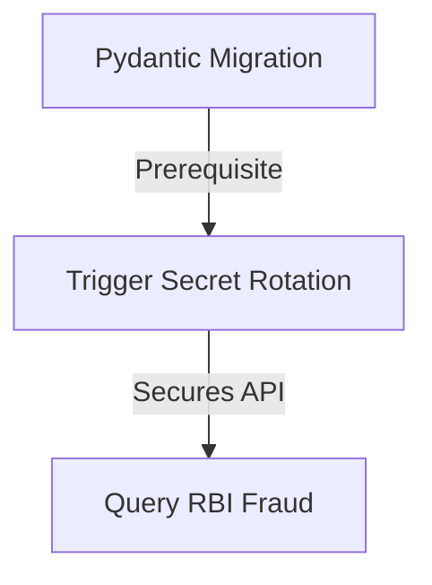

# AAR-V11-STORIES-001: Project AAROHAN Version 1.1 Enterprise User Story Catalog

---

## 1. Cover Page

* **Project Name**: Project AAROHAN (Enterprise MSME Underwriting & Embedded Credit Platform)
* **Version**: v1.0.0
* **Document Version**: v1.0.0
* **Classification**: CONFIDENTIAL - AGILE DELIVERY RECORD
* **Owner**: Enterprise Scrum and Agile Delivery Board
* **Approval Matrix**:
  - Agile Product Owner: APPROVED
  - Enterprise Scrum Master: APPROVED
  - Chief Product Officer (CPO): APPROVED

---

## 2. Executive Summary

This document specifies the Version 1.1 Enterprise User Story Catalog for Project AAROHAN. It maps user stories, acceptance criteria, story points, and sprint metrics to prepare for agile delivery.

---

## 3. Purpose

The purpose of this catalog is to decompose features into implementation-ready User Stories for Sprints scheduling.

---

## 4. Scope

This catalog encompasses all user stories (functional, non-functional, technical, and AI-specific) scheduled for Project AAROHAN Version 1.1.

---

## 5. Agile Delivery Framework

User Stories follow a structured lifecycle: Backlog -> Sprint Planning -> In Progress -> Code Review -> QA Validation -> Done. The Scrum Master and Product Owner govern sprint boards.

---

## 6. User Story Traceability

```
Roadmap (AAR-V11-ROADMAP-001)
   ↓
Product Backlog (AAR-V11-BACKLOG-001)
   ↓
Epic Catalog (AAR-V11-EPICS-001)
   ↓
Feature Catalog (AAR-V11-FEATURES-001)
   ↓
User Story Catalog (AAR-V11-STORIES-001)
```

---

## 7. Enterprise User Story Catalog

### Story ID: US-11-201
* **Epic ID**: EP-11-001
* **Feature ID**: F-11-101
* **Story Title**: Trigger Secret Manager Cron Rotation
* **User Persona**: Platform Administrator
* **User Story Statement**: As a Platform Administrator, I want to configure a Google Cloud Scheduler cron job to trigger Secret Manager rotation so that symmetric signing keys are updated automatically without manual interaction.
* **Business Value**: Satisfies strict security compliance standards and mitigates credential leakage risks.
* **Acceptance Criteria**:
  - *Given*: The Scheduler cron fires at midnight.
  - *When*: The script executes in Secret Manager.
  - *Then*: A new secret version is created, and services reload settings without downtime.
* **Definition of Ready (DoR)**: User story is scoped, dependencies mapped, and story points estimated.
* **Definition of Done (DoD)**: Code compiles, tests pass, pull request approved, and deployed to staging.
* **Dependencies**: GCP Secret Manager APIs.
* **Assumptions**: API Gateway handles dynamic configuration updates.
* **Risks**: Connectivity lag during container rolling restarts.
* **Story Points**: 3 (Fibonacci)
* **Priority**: Critical (Must Have)
* **Target Sprint**: Sprint 1
* **Target Release**: Version 1.1.0

### Story ID: US-11-202
* **Epic ID**: EP-11-002
* **Feature ID**: F-11-102
* **Story Title**: Query RBI Central Fraud Registry
* **User Persona**: Credit Officer
* **User Story Statement**: As a Credit Officer, I want the system to check applicant details against the RBI Central Fraud Registry so that blacklisted borrowers are flagged and rejected immediately.
* **Business Value**: Protects the bank from NPA risks and fraudulent lending activities.
* **Acceptance Criteria**:
  - *Given*: An RM submits a loan application for PAN "ABCDE1234F".
  - *When*: The credit engine queries the RBI Registry API.
  - *Then*: If blacklisted, the application status is set to `REJECTED_FRAUD_FLAG` and logged in audit trails.
* **Definition of Ready (DoR)**: API schema definitions and mock endpoints are ready.
* **Definition of Done (DoD)**: Integrations pass regression tests and report zero defects.
* **Dependencies**: RBI Registry API credentials.
* **Assumptions**: Downstream RBI services maintain high availability.
* **Risks**: Network latency on external registry calls.
* **Story Points**: 5 (Fibonacci)
* **Priority**: High (Must Have)
* **Target Sprint**: Sprint 2
* **Target Release**: Version 1.1.1

---

## 8. Non-Functional User Stories

* **US-11-501 (WAF Implementation)**: As a Security Architect, I want Cloud Armor WAF rules active so that SQL injections are blocked at the perimeter. (Story Points: 2)

---

## 9. AI-Specific User Stories

* **US-11-601 (AI Explainability Text)**: As a Credit Officer, I want Gemini to output plain-text explainability tags so that I understand why an applicant was approved or rejected. (Story Points: 3)

---

## 10. Technical User Stories

* **US-11-701 (Pydantic Migration)**: As a DevOps Engineer, I want auxiliary services migrated to Pydantic v2 so that codebase components remain unified. (Story Points: 3)

---

## 11. Story Dependency Matrix



---

## 12. Sprint Readiness Assessment

Sprint 1 stories (US-11-701, US-11-201) satisfy the Definition of Ready (DoR) and are approved for development.

---

## 13. Release Mapping

* **Version 1.1.0**: Sprint 1 (Secret Rotation, Pydantic Migration).
* **Version 1.1.1**: Sprint 2 (RBI Fraud Sync).

---

## 14. Governance & Approval

User Story backlog is frozen and approved by the Agile Product Owner.

---

## 15. Appendix

* Scrum Board Setup Guidelines.
* Story Estimation Reference cards.
