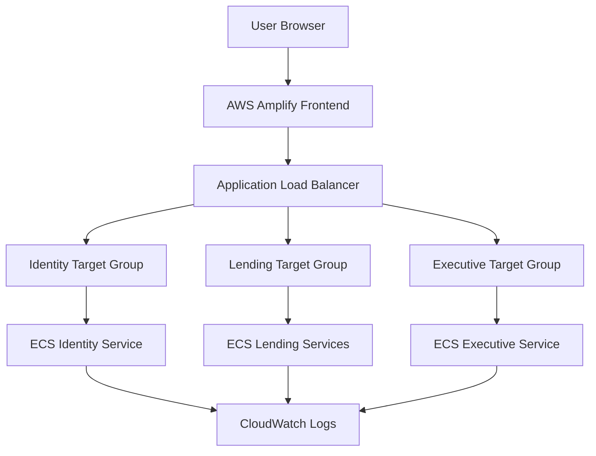

# AWS Architecture

This submission package reflects the AWS production profile used by the deployed environment and the reviewed infrastructure artifacts.

## AWS Services Used

- AWS Amplify for the hosted frontend.
- Amazon ECS on Fargate for backend task execution.
- Application Load Balancer for traffic routing.
- Target groups for identity, lending, and executive traffic.
- CloudWatch for application logs and operational visibility.

## Infrastructure Evidence

- ECS cluster name: `aarohan-hackathon-cluster`
- ALB name: `aarohan-alb`
- Amplify app ID: `d2lek1l0vzlyj6`
- Amplify branch: `develop/v1.1`
- Amplify URL: `https://develop-v1-1.d2lek1l0vzlyj6.amplifyapp.com/`

## Verification Notes

- The ECS and ALB topology is declared in the repository infrastructure template.
- The live browser session confirmed the Amplify-hosted portal is reachable.
- Live AWS console metrics for task counts and target health were not directly observable in this workspace, so they are treated as unresolved operational evidence.
