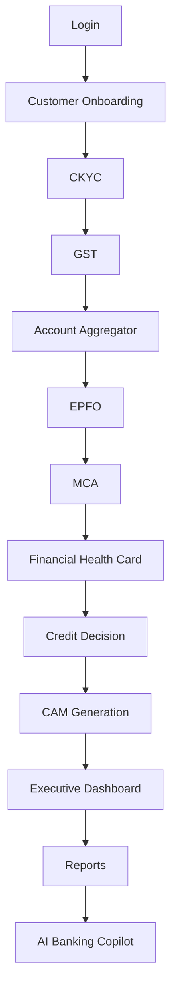

# Business Workflow

The production user journey is intentionally linear so judges can see the full MSME underwriting story without switching systems.

## Workflow Intent

- Login establishes the authenticated role.
- Onboarding builds the borrower context.
- CKYC, GST, AA, EPFO, and MCA add compliance and business evidence.
- Financial Health Card compresses the borrower’s condition into an explainable score.
- Credit Decision and CAM turn analysis into an underwriting package.
- Executive Dashboard and Reports translate the case into a management view.
- AI Banking Copilot helps the operator navigate the workflow and surface the next best action.

## Judge-Friendly Outcome

A reviewer can follow the workflow from left to right and understand how AAROHAN turns fragmented lending checks into a single decision narrative.
