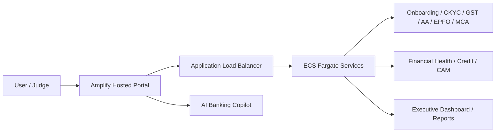
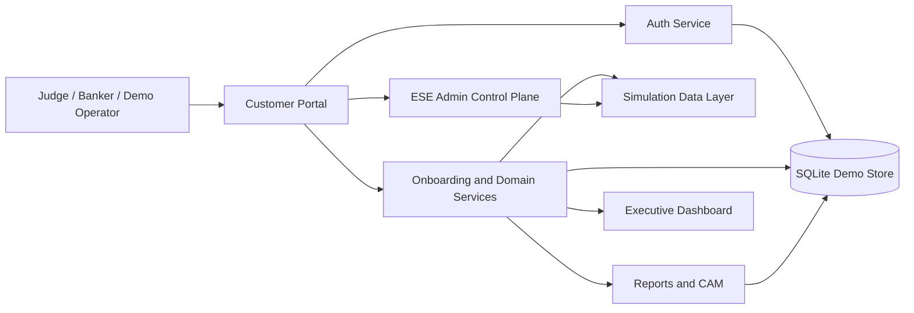

# Project AAROHAN

Project AAROHAN is an enterprise MSME lending platform and digital banking twin built for hackathon demonstrations, architecture review, and controlled lending simulations. It combines a React customer portal, FastAPI microservices, deterministic demo personas, report generation, and an executive control plane to walk judges through an end-to-end underwriting journey in a reproducible way.

## Hackathon Submission Snapshot

### Features

- Customer Onboarding
- CKYC
- GST Analytics
- Account Aggregator
- EPFO
- MCA
- Financial Health Card
- Credit Decision Engine
- CAM Generation
- Executive Dashboard
- AI Banking Copilot

### Technology Stack

- React + TypeScript
- FastAPI
- Python
- AWS ECS Fargate
- Amazon ECR
- Application Load Balancer
- CloudFormation
- AWS Amplify
- Docker

### Architecture



### Demo

Live Amplify URL: https://develop-v1-1.d2lek1l0vzlyj6.amplifyapp.com/

### Documentation

- [Executive Summary](Executive_Summary.md)
- [Solution Architecture](Solution_Architecture.md)
- [AWS Architecture](AWS_Architecture.md)
- [Testing and Validation](Testing_and_Validation.md)
- [Final Submission Report](Final_Submission_Report.md)

## Project Overview

The repository models a DPI-aligned MSME lending experience for Indian banks and fintech teams. A customer can be onboarded digitally, verified through registry-style services, scored through financial-health logic, routed through credit appraisal, and reviewed in executive and relationship-manager views. The same platform also supports a simulation-first demo mode so judges can replay the journey with seeded personas and predictable outcomes.

The most relevant acceptance and release references are:

- [PROJECT_CONTEXT.md](PROJECT_CONTEXT.md)
- [AAR-BUILD-020_Hackathon_Release_Candidate_Report.md](AAR-BUILD-020_Hackathon_Release_Candidate_Report.md)
- [AAR-RC1_Final_Verification_Report.md](AAR-RC1_Final_Verification_Report.md)
- [AAR-LCP-008_Project_AAROHAN_API_Reference_Guide.md](AAR-LCP-008_Project_AAROHAN_API_Reference_Guide.md)

## Problem Statement

MSME lending typically requires multiple fragmented checks across customer identity, business registration, tax history, cash flow, workforce data, and internal policy review. This slows down underwriting, creates inconsistent decisions, and makes it hard to present a clear credit story to business reviewers and executives.

Project AAROHAN addresses that by consolidating the journey into a single enterprise flow with curated demo states, explainable outcomes, and repeatable portfolio views.

## Solution

The platform provides:

- A customer-facing portal for login, onboarding, demo personas, and lending journeys.
- A simulation and control layer for deterministic demo resets and guided walkthroughs.
- Domain services for GST, Account Aggregator, CKYC, MCA, EPFO, CAM, Financial Health Card, credit decisioning, portfolio, and executive dashboards.
- Demo-friendly report generation for judges and reviewers.

## Key Features

- Demo login and curated quick-login personas.
- Guided RC1 demo studio for hackathon presentations.
- Multi-step lending journey from onboarding to executive review.
- Financial Health Card, credit decision, CAM, fraud, executive summary, and portfolio reports.
- Persona-driven demo scenarios with deterministic outcomes.
- Relationship Manager and executive dashboard experiences.
- JWT-based authentication and role-aware access.
- Local simulation data and repeatable reset flows for live judging.

## Technology Stack

### Frontend

- React 19
- TypeScript
- Vite
- Material UI
- Emotion
- Zustand
- TanStack React Query
- TanStack Router
- React Hook Form
- Zod

### Backend

- Python 3.12+ runtime
- FastAPI
- Uvicorn
- Pydantic v2
- SQLAlchemy
- Alembic

### Data and Runtime

- SQLite for local and demo flows
- Docker and docker compose for local orchestration
- Poetry for Python dependency management
- npm workspaces and Turbo for the frontend build pipeline

## Architecture



The portal orchestrates the user experience, the auth service handles sign-in and role claims, the domain services compute lending outputs, and the ESE control plane keeps demo personas, scenarios, and reports repeatable.

## Repository Structure

- [apps/customer-portal](apps/customer-portal) - React portal for login, demo studio, lending journey, and dashboards.
- [services](services) - FastAPI microservices for auth, onboarding, registry simulation, CAM, executive views, portfolio, and related domains.
- [ese](ese) - Demo personas, datasets, seeded databases, and simulation assets.
- [tests](tests) - Repository-level integration and regression tests.
- [scripts](scripts) - Operational helpers and maintenance scripts.
- [docs](docs) - Additional engineering documentation.
- [platform](platform) - Platform-facing documentation and reference material.
- [infrastructure](infrastructure) - Deployment and infrastructure documentation.

## Installation

### Prerequisites

- Node.js 18 or later
- Python 3.12 or later
- Poetry
- Docker and Docker Compose for local simulation runs

### Setup

1. Install JavaScript dependencies from the repository root.

```bash
npm install
```

2. Build the workspace.

```bash
npm run build
```

3. Start the portal in development mode.

```bash
npm --prefix apps/customer-portal run dev
```

4. Start the auth service in a separate terminal for local demo validation.

```powershell
Set-Location services/auth-service
poetry run python -m uvicorn app.main:app --host 127.0.0.1 --port 9000
```

5. Start the ESE control plane in a separate terminal when exercising the RC1 demo flow.

```powershell
Set-Location services/ese-admin-service
$env:PYTHONPATH='D:\SAMUEL\HACK 2 SKILL\IDBI MSME\Project AAROHAN\services\ese-core;D:\SAMUEL\HACK 2 SKILL\IDBI MSME\Project AAROHAN\services\ese-admin-service'
poetry run python -m uvicorn app.main:app --host 127.0.0.1 --port 8090
```

## Running Locally

1. Open the portal in the browser at the Vite dev URL.
2. Start the auth service on port 9000.
3. Start the ESE admin control plane on port 8090.
4. Sign in with one of the demo accounts below.
5. Open Demo Studio and select a persona.
6. Step through onboarding, registry checks, CAM, and dashboard review.

For the release-candidate demo, the built portal can also be previewed after a successful build.

## Demo Credentials

All seeded demo accounts use the same password:

**Password:** AarohanPass123!

| Role | Mobile Number | Suggested Use |
| --- | --- | --- |
| Relationship Manager | 9876543210 | Default login for the main demo journey |
| Administrator | 9900112233 | Platform and control-plane access |
| Credit Manager | 9812345678 | Credit appraisal and CAM review |
| Operations Officer | 9823456789 | Operations and exception handling |
| Executive | 9834567890 | Executive dashboard review |
| Auditor | 9845678901 | Audit and governance views |
| Trainer | 9856789012 | Guided demo facilitation |
| Demo User | 9988776655 | Generic sandbox persona |

## Demo Personas

The RC1 demo studio includes curated lending personas and outcome paths such as:

- Priya Textile Works - healthy borrower with approved-style dashboard outcomes.
- GreenAgro Cooperative - moderate-risk borrower with watchlist-style indicators.
- QuickLogistics - stressed borrower with rejected-style indicators.

These personas are designed to demonstrate different risk profiles, credit decisions, and dashboard outcomes without manual data preparation.

## Screenshots Placeholders

Add the following screenshots before publishing the repository publicly:

- Login screen placeholder
- Demo Studio placeholder
- Lending journey placeholder
- CAM view placeholder
- Executive dashboard placeholder

## API Overview

Full endpoint inventory: [AAR-LCP-008_Project_AAROHAN_API_Reference_Guide.md](AAR-LCP-008_Project_AAROHAN_API_Reference_Guide.md)

High-value API groups:

- Auth: /auth/login, /auth/me, /auth/token/refresh, /auth/logout
- Onboarding: customer CRUD, validation, persona loading, workflow launch
- Registry and bureau flows: CKYC, GST, MCA, EPFO, Account Aggregator
- Credit outputs: Financial Health Card, credit decision, CAM generation
- Executive flows: portfolio, executive dashboard, report generation
- Demo control plane: /ese/control, persona changes, scenario changes, reset actions

## Project Highlights

- Enterprise-style architecture narrative with strong demo instrumentation.
- Deterministic walkthroughs for hackathon judging.
- Clear separation between portal, domain services, simulation data, and control plane.
- Executive and RM views that make the lending story understandable in minutes.
- Hackathon submission artifacts that document validation, RC1 scope, and release readiness.

## Future Roadmap

- Production hardening and secret rotation automation.
- Broader external integration hardening for registry and bureau flows.
- Explainable underwriting improvements.
- Shared package and platform asset reconciliation.
- Infrastructure code completion and deployment alignment.

## License

No license file is currently declared in the workspace. Before public open-source release, add an explicit license that matches the intended publication model.
