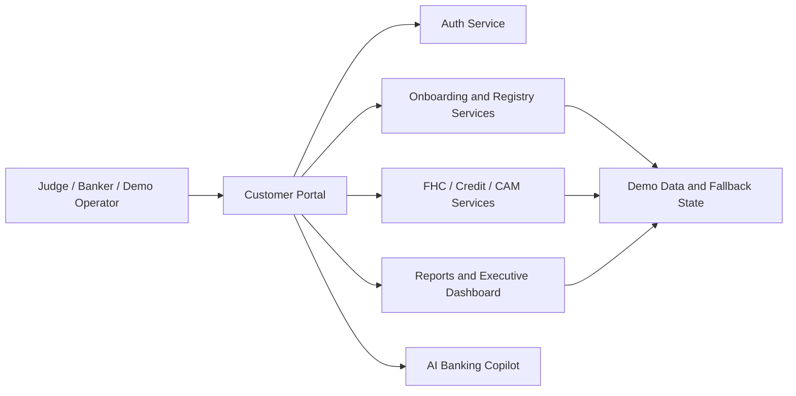

# Solution Architecture

Project AAROHAN is structured as a portal-led, service-oriented lending workspace. The customer portal is the main user interface, while FastAPI services provide the domain logic for authentication, onboarding, registry checks, financial health, credit decisioning, CAM generation, executive summaries, and AI copilot support.

## Solution Overview

- The portal orchestrates the user journey.
- Auth service manages login and JWT-based session control.
- Domain services expose lending, compliance, and reporting APIs.
- The copilot provides role-aware guidance and workflow shortcuts.
- Demo personas and fallback paths keep the journey repeatable for judges.

## Innovation

The main architectural idea is not novelty in infrastructure, but novelty in orchestration: the platform makes a complex MSME lending process presentable as one coherent, role-sensitive story with explainable outcomes.

## Design Principles

- Keep the business flow linear and judge-friendly.
- Preserve deterministic demo behavior.
- Expose meaningful runtime fallbacks instead of hard failures.
- Separate presentation, authorization, and lending logic.
