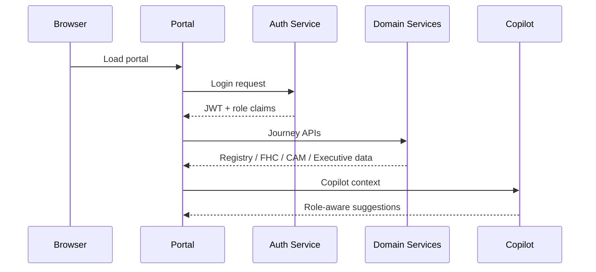

# Technical Architecture

## Frontend

- React 19
- TypeScript
- Vite
- Material UI
- TanStack Query and TanStack Router
- Role-aware navigation and copilot controls

## Backend

- FastAPI microservices
- JWT authentication
- RBAC via permission-based access checks
- CORS-enabled APIs
- Health and readiness endpoints

## Runtime Flow

1. User loads the portal from Amplify.
2. User authenticates against the identity service.
3. The portal fetches role-aware data and navigates through the lending workflow.
4. Domain services return financial health, registry, and credit outputs.
5. Reports and copilot surfaces summarize the current state.

## Security Model

- JWT bearer tokens for authenticated sessions.
- Permission-based RBAC for navigation and API access.
- CORS middleware on the gateway and auth service.
- Build-time environment variables for frontend API endpoints.

## Engineering Notes

The application is deliberately not being refactored in this submission package. The documentation reflects the current runtime behavior and the deployed AWS shape as observed in the repository and live browser session.
